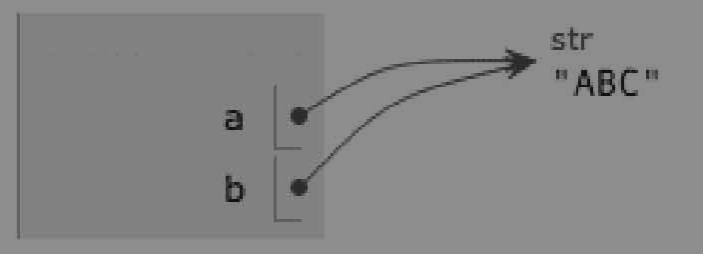

## 第一章: Python3 基础入门

### 1. 初识 Python

##### Python 简介

Python是由荷兰人吉多·范罗苏姆（Guido von Rossum）发明的一种编程语言，是目前世界上最受欢迎和拥有最多用户群体的编程语言。


##### Python 历史

1. 1989年圣诞节：Guido开始写Python语言的编译器。
2. 1991年2月：第一个Python解释器诞生，它是用C语言实现的，可以调用C语言的库函数。
3. 1994年1月：Python 1.0正式发布。
4. 2000年10月：Python 2.0发布，Python的整个开发过程更加透明，生态圈开始慢慢形成。
5. 2008年12月：Python 3.0发布，引入了诸多现代编程语言的新特性，但并不完全兼容之前的Python代码。
6. 2020年1月：在Python 2和Python 3共存了11年之后，官方停止了对Python 2的更新和维护，希望用户尽快过渡到Python 3。

##### Python 优缺点

Python的优点很多，简单为大家列出几点。

1. 简单明确，跟其他很多语言相比，Python更容易上手。
2. 能用更少的代码做更多的事情，提升开发效率。
3. 开放源代码，拥有强大的社区和生态圈。
4. 能够做的事情非常多，有极强的适应性。
5. 能够在Windows、macOS、Linux等各种系统上运行。

Python最主要的缺点是执行效率低，但是当我们更看重产品的开发效率而不是执行效率的时候，Python就是很好的选择。


##### Python 应用领域

目前Python在**Web服务器应用开发**、云基础设施开发、**网络数据采集**（爬虫）、**数据分析**、量化交易、**机器学习**、**深度学习**、自动化测试、自动化运维等领域都有用武之地。


### 2. 数据类型

计算机是可以做数学计算的机器，计算机程序理所当然可以处理各种数值。计算机能处理的远不止数值，还有文本、图形、音频、视频、网页等各种各样的数据，不同的数据需要定义不同的数据类型。Python 3中有6种标准的对象类型：Number（数字）、String（字符串）、List（列表）、Tuple（元组）、Sets（集合）、Dictionary（字典）。本节首先讲解Number数据类型，其他5种数据类型在后续章节介绍。Python 3支持3种不同的数值类型：整型（int）、浮点型（float）、复数（complex）。


##### 整型

int通常被称为整型或整数，是正、负整数，不带小数点。在Python 3中，整型没有限制大小，可以当作long类型使用，所以Python 3没有Python 2的long类型。例如，公司组织旅游，大家坐上了大巴准备出发，现在需要统计有多少人在车上，老板吩咐小萌清点一下人数，小萌花了两分钟逐个点了一遍，总计51人。小萌在交互模式下输入：

```python
>>> 51
51
```

这里使用的是整型。

到服务区后，大家休息了一下，再次准备出发时，老板又吩咐小萌清点一下人数。小萌苦笑一下，看来又得花两分钟清点人数了，为什么不叫一个人帮忙从车的另一头清点呢？于是小萌叫小智帮忙从另一头清点一下人数。一分钟后，小萌和小智在车中间碰上了，小智告诉小萌他的计数是25人，小萌在交互模式下输入：

```python
>>> 25 + 25
50
```

小萌准备把数字报告给老板，突然想到上次报告的是51人，这次是50人，数字不同啊，还差1人，小萌在交互模式下输入：

```python
>>> 51 - 50
1
```

怎么少了一人呢？小萌突然慌了，然后仔细一想，原来是把自己忘加上了，于是再次输入：

```python
>>> 25 + 25 + 1
51
```

这次没问题了。于是小萌给了老板和上次一样的答案。老板示意司机可以发车了，又突然叫停，看天气挺热的，大家路上可能会口渴，于是吩咐小萌去服务区给每人买两瓶水，再买一大包糖给大家在路上补充能量。每人两瓶水，一共要买多少瓶呢？小萌在交互模式下输入：

```python
>>> 51 * 2
102
```

一共要买102瓶水，这么多，于是小萌让小智帮忙一起去提水。

水和糖都买回来了，水好分，给每人两瓶就是，这一大包糖该怎么给大家呢？看包装袋上有总颗数，一共有153颗，每人多少颗呢？小萌在交互模式下输入:

```python
>>> 153 / 51
3.0
```

好了，给每人发3颗糖就可以了。于是小萌高高兴兴发糖去了，小智也帮忙一起发，每人给3颗。糖终于发完了，小萌很惬意，坐下来补充能量。小萌突然想到了什么，有153颗糖，分给51人，每人3颗糖没错，但计算出来的结果怎么是3.0呢？假如有155颗糖，计算结果会是怎样的呢？输入以下数据：

```python
>>> 155 / 51
3.0392156862745097
```

如果按这个结果分，就没有办法分了。这是怎么回事呢？

原因是：在整数除法中，除法（/）计算结果是浮点数，即使两个整数恰好整除，结果也是浮点数。如果只想得到整数的结果，丢弃可能的分数部分，可以使用地板除（//），整数的地板除（//）永远是整数，即使除不尽。

更改前面输入的数据:

```python
153 // 51
3
```

这时就不是浮点数了。再看看155颗糖的结果：

```python
155 // 51
3
```

153和155除以51都是3，这个就不对了。原来还有一个余数。

因为地板除（//）只取结果的整数部分，所以Python提供了一个余数运算，可以得到两个整数相除的余数，看看153和155对51的取余：

```python
>>> 153 % 51
0
>>> 155 % 51
2
```

通过上面的案例，我们就已经大致掌握了整型的使用了。


##### 浮点型

浮点型由整数部分与小数部分组成，也可以使用科学计数法表示。比如，老板问小萌总共花了多少钱。小萌理了一下思绪，每瓶水3.3元，一共102瓶，总共多少钱呢？

输入如下：

```python
>>> 3.3 * 102
336.59999999999997
```

结果怎么这么长？小萌看傻了，不过冷静一看，原来是：整数和浮点数在计算机内部存储的方式不同，整数运算永远是精确的，而浮点数运算可能会有四舍五入的误差。

“老板，一共336.6元”。“好的，加上买糖的钱了吗”？小萌暗骂自己，瞧我这脑筋。再计算一次，每瓶水3.3元，一共102瓶，再加上一包糖15.5元，输入如下：

```python
>>> 3.3 * 102 + 15.5
352.09999999999997
```

这结果好像很凌乱，应该这么输入：

```python
>>> 336.6 + 15.5
352.1
```

这个结果就好看多了。报告给老板，一共花费352.1元。

小萌又开始思考了，浮点数相乘结果这么怪，浮点数的除法是怎样的呢？想到了就实践，输入如下：

```python
>>> 153 / 51.0
3.0
```

这个结果和153除以51的结果是一样的，如果155除以51.0呢？输入如下：

```python
>>> 155 / 51.0
3.0392156862745097
```

结果和155除以51也是一样的。那做地板除和取余又是怎样的呢？输入如下：

```python
>>> 155 // 51.0
3.0
>>> 155 % 51.0
2.0
```

可以看出，得到的结果都是浮点型的。


##### 复数

复数由实数部分和虚数部分构成，可以用a + bj或complex(a, b)表示，复数的实部a和虚部b都是浮点型。

Python支持复数，不过Python的复数我们当前阶段使用或接触得比较少，此处就不再具体讲解，有兴趣可以自行查阅相关资料。


##### 数据类型转换

有时我们要对数据内置的类型进行转换，只需要将数据类型作为函数名即可。数据的类型转换时有如下4个函数可以使用：

- int(x)将x转换为一个整数。

- float(x)将x转换为一个浮点数。

- complex(x)将x转换为一个复数，实数部分为x，虚数部分为0。

- complex(x, y)将x和y转换为一个复数，实数部分为x，虚数部分为y。x和y是数字表达式。

比如，小萌去购物，计算出应付金额是352.1元，超市老板为免除找零的麻烦，让小萌支付352元。Python中的转换可以执行如下：

```python
>>> int(352.1)
352
```

很容易就得到了转换后的结果。但是金额的操作必须用浮点数进行记账，这个容易，用float函数就行了。输入如下：

```python
>>> float(352.1)
352.1
```

这样就得到了浮点型数据。

把int函数放入float函数中是否可以呢？尝试一下：

```python
>>> float(int(352.1))
352.0
```

这里先把352.1取整，得到整数352，再用float将352转换成浮点数352.0，这样就得到我们需要的结果了。虽然输入的字符看起来有点复杂，但是还是得到结果了。这其实是函数的嵌套，后面会进行具体介绍，此处做相关了解即可。


##### 常量

所谓常量，就是不能改变现有的值的变量，比如常用的数学常数π就是一个常量。在Python中，通常用全部大写的变量名表示常量。

Python中有两个比较常见的常量，即PI和E。PI：数学常量pi（圆周率，一般以π表示）。E：数学常量e，即自然对数。这两个常量将会在后续章节中使用，具体的用法在使用中体现。


### 3. 变量与关键字

编程语言最强大的功能之一是操纵变量。变量（variable）是一个需要熟知的概念，如果你觉得数学让你抓狂，别担心，Python中的变量很好理解。变量基本上代表某个值的名字。


##### 变量

变量指向各种类型值的名字，以后再用到这个值时，直接引用名字即可，不用再写具体的值。在Python中，变量的使用环境非常宽松，没有明显的变量声明，而且类型不是固定的。你可以把一个整数赋值给变量，如果觉得不合适，把字符串赋给变量也可以。在Python中，等号（=）是赋值语句，可以把任意数据类型赋值给变量。

如果要定义一个名为xiaohong的变量，该怎么操作呢？输入如下：

```python
# 字符串必须以引号标记开始，并以引号标记结束
>>> xiaohong = 'XiaoHong'
```

此操作解释：xiaohong是我们创建的变量，= 是赋值语句，XiaoHong是变量值，需要用引号标记。整句话的意思为：创建变量xiaohong并赋值为XiaoHong。

小萌疑惑了，怎么前面输入后按回车键就能输出内容，这里怎么跳到输入提示状态呢？别急，还记得前面讲的print()吗？print()是输出函数，看看这里，没有使用输出函数，屏幕上当然不会输出内容了。要输出内容应该怎么操作呢？我们尝试一下：

```python
>>> print(xiaohong)
XiaoHong
```

不错，尝试成功了。但为什么小萌输入的是print(xiaohong)，结果却输出XiaoHong呢？这就是变量的好处，可以只定义一个变量，比如xiaohong，把一个值赋给这个变量，比如XiaoHong，这样当我们输出xiaohong时，实际上输出的是XiaoHong。

在使用变量前需要对其赋值。没有值的变量是没有意义的，编译器也不会编译通过。例如，定义一个变量为abc，不赋任何值，输入及结果如下：

```python
>>> abc
Traceback (most recent call last):
  File "<stdin>", line 1, in <module>
NameError: name 'abc' is not defined
```

同一个变量可以反复赋值，而且可以是不同类型的变量，输入如下：

```python
>>> a = 123
>>> a
123
>>> a = 'abc'
>>> print(a)
abc
```

这种变量本身类型不固定的语言称为动态语言，与之对应的是静态语言。静态语言在定义变量时必须指定变量类型，如果赋值时类型不匹配就会报错。和静态语言相比，动态语言更灵活。

当不能确定变量或数据的类型时，可以借助解释器内置的函数type进行确认。在交互模式下输入如下：

```python
>>> type('hello world')
<class 'str'>
```

测试得到输入的结果类型是字符串类型（str）。


```python
>>> type(100)
<class 'int'>
```

测试得到输入的结果类型是整型（int）。


```python
>>> type(3.0)
<class 'float'>
```

测试得到输入的结果类型是浮点型（float）。


```python
>>> a = 'test type'
>>> type(a)
<class 'str'>
```

测试得到输入的结果类型是字符串类型（str）。


```python
>>> b = 100
>>> type(b)
<class 'int'>
```

测试得到输入的结果类型是整型（int）。


```python
>>> c = 3.0
>>> type(c)
<class 'float'>
```

测试得到输入的结果类型是浮点型（float）。


只要是用双引号或单引号括起来的值，都属于字符串。在交互模式下输入：

```python
>>> type('test single quotes')
<class 'str'>
>>> type('test double quote')
<class 'str'>
>>> type("100")
<class 'str'>
>>> type("3.0")
<class 'str'>
>>> b = '3'
>>> type(b)
<class 'str'>
>>> c = '3.0'
>>> type(c)
<class 'str'>
```

测试得到输入的结果类型都是字符串类型（str）。

注意不要把赋值语句的等号等同于数学中的等号。比如下面的代码：

```python
a = 100
a = a + 200
```

在编程语言中，赋值语句先计算右侧的表达式a+200，得到结果300，再赋给变量a。由于a之前的值是100，重新赋值后，a的值变成300。我们通过交互模式验证，输入如下：

```python
>>> a = 100
>>> a = a + 200
>>> print(a)
300
```

和我们所描述的结果一致。

理解变量在计算机内存中的表示也非常重要。当我们输入如下：

```python
>>> a = 'ABC'
```

这时，Python解释器做了两件事情：

- 在内存中创建了一个'ABC'字符串。

- 在内存中创建了一个名为a的变量，并把它指向'ABC'。

也可以把一个变量a赋值给另一个变量b，这个操作实际上是把变量b指向变量a所指向的数据，例如下面的代码：

```python
>>> a = 'ABC'
>>> b = a
>>> a = 'XYZ'
>>> print(b)
```

最后一行输出变量b的内容到底是'ABC'还是'XYZ'呢？如果从数学意义上理解，就会错误地得出b和a相同，应该是'XYZ'。实际上，b的值是'ABC'。我们一行一行地执行代码，就可以看到到底发生了什么事。

执行a = 'ABC'，解释器创建了字符串'ABC'和变量a，并把a指向'ABC'。


执行b = a，解释器创建了变量b，并把b指向a指向的字符串'ABC'。



执行a = 'XYZ'，解释器创建了字符串'XYZ'，并把a的指向改为'XYZ'，但b没有更改。


最后输出变量b的结果自然是'ABC'了。


##### 变量名称

程序常常选择有意义的名称作为变量名，以此标记变量的用途。

变量名是由数字或字符组成的任意长度的字符串，必须以字母开头。使用大写字母是合法的，但变量名建议使用小写字母开头。Python是区分大小写的。举个例子来说，Name和name是两个不同的变量名。在交互模式下输入如下：

```python
>>> name = 'study python is happy'
>>> Name = 'I agree with you'
>>> print(name)
study python is happy
>>> print(Name)
I agree with you
```

下划线“_”可以出现在变量名中，经常用于连接多个词组，如happy_study、do_it_with_more_practice。在交互模式下输入如下：

```python
>>> happy_study = 'stay hungry stay foolish'
>>> print(happy_study)
stay hungry stay foolish
```

如果给变量取非法的名称，解释器就会显示语法错误。请看下面的示例：

```python
>>> 2wrongtest = 'just for test'
File "<stdin>", line 1
    2wrongtest = 'just for test'
             ^
SyntaxError: invalid syntax

# 该示例提示语法错误，错误信息为无效的语法，原因为不是以字母开头的。
```

```python
>>> xiaoming@me = 'surprised'
  File "<stdin>", line 1
SyntaxError: can't assign to operator

# 示例提示语法错误，错误信息为不能做指定操作，原因是包含一个非法字符@。
```


Python不允许使用关键字作为变量名，请看下面的例子：

```python
>>> from = 'from'
  File "<stdin>", line 1
    from = 'from'
         ^
SyntaxError: invalid syntax

# from 是 Python的一个关键字，因此出现错误。
# Python3 中共有33个关键字，都不能作为变量名来使用。
```

Python3 查看关键字

```python
>>> import keyword
>>> print(keyword.kwlist)
```


### 4. 语句

语句是Python解释器可以运行的一个代码单元，也可以理解为可以执行的命令。

我们目前已经使用了两种语句：print打印语句和赋值语句。赋值语句有两个作用：一是建立新的变量，二是将值赋予变量。任何变量在使用时都必须赋值，否则会被视为不存在的变量。在交互模式下输入如下：

```python
>>> advice = 'boss, we want have a lunch'

# 当前代码可以被称之为 python 语句
```

查看当前 `advice` 变量类型：

```python
>>> type(advice)
<class 'str'>
```

在这个语句中，advice的类型是字符串（str）。还有什么类型的赋值语句呢？对了，前面还学习了整型和浮点型，在交互模式下输入：

```python
>>> money = 99999
>>> type(money)
<class 'int'>
>>> spend = 1.11
>>> type(spend)
<class 'float'>
```

以上代码使用变量状态图表示：


### 5. 表达式

表达式是值、变量和操作符的组合。单独一个值可以看作表达式，单独的变量也可以看作表达式。

表达式和语句一般不容易区分，很多人会将两者混在一起。那么语句和表达式之间有什么区别呢？

表达式是某事，语句就是做某事，也就是告诉计算机做什么。比如3 * 3是9，print(3 * 3)输出也是9。区别在哪里呢？我们在交互模式下输入如下：

```python
>>> 3 * 3
9
>>> print(3 * 3)
9
```

在交互模式下，结果都是一样的。这是因为解释器总是输出所有表达式的值（内部都使用相同的函数对结果进行呈现，后面会有详细介绍）。一般情况下，Python不会这么做，毕竟3 * 3这样的表达式不能做什么有趣的事情，而编写print(3 * 3)会有一个显式的输出结果9。

语句和表达式之间的区别在赋值时表现得更加明显。因为语句不是表达式，所以没有值可供交互式解释器输出。比如在交互模式下输入如下：

```python
>>> a = 100
>>>
>>> 10 * 10
100
```

从输入结果可以看到，赋值语句输入完成后，下面立刻出现了新的提示输入符。表达式输入完成后，下面立刻得到了结果。不过对于赋值语句，有些东西已经变了，变量a现在绑定了一个值100。

这个是语句特性的一般定义：它们改变了事物。比如，赋值语句改变了变量，print语句改变了屏幕显示的内容。

赋值语句可能是所有计算机程序设计语言中最重要的语句类型，尽管现在还难以说清赋值语句的重要性。变量就像临时的 “存储器” （就像厨房中的锅碗瓢盆一样），强大之处在于，在操作变量时并不需要知道存储了什么值。比如，即使不知道x和y的值到底是多少，也会知道x*y的结果就是x和y的乘积。所以，可以通过多种方法使用变量，而不需要知道在程序运行时，最终存储的值是什么。


### 6. 运算符和操作对象

运算符和操作对象是计算机中比较常见的，所有计算都涉及运算符和操作对象。本节将介绍 Python 中的运算符和操作对象。


##### 什么是运算符和操作对象

运算符是一些特殊符号的集合，我们前面学习的加（+）、减（-）、乘（*）、除（/）、地板除（//）、取余（%）等都是运算符。操作对象是由运算符连接起来的对象。加、减、乘、除4种运算符是我们从小学就开始接触的，不过乘除的写法不一样，这个要记住。

Python支持以下7种运算符：

- 算术运算符。

- 比较（关系）运算符。

- 赋值运算符。

- 逻辑运算符。

- 位运算符。

- 成员运算符。

- 身份运算符。


##### 算术运算符

以下示例为算术运算符的描述和实例。假设变量a为10，变量b为5。


下面进行实战。在交互模式下输入如下：

```python
(base) poppies@Mac-Pro ~ % python
Python 3.7.13 (default, Mar 28 2022, 07:24:34) 
[Clang 12.0.0 ] :: Anaconda, Inc. on darwin
Type "help", "copyright", "credits" or "license" for more information.
>>> a = 10
>>> b = 5
>>> print(a + b)
15
>>> print(a - b)
5
>>> print(a * b)
50
>>> print(a / b)
2.0
>>> print(a ** b)
100000
>>> print(9 // 2)
4
>>> print(9.0 // 2.0)
4.0
>>> 
```


##### 比较运算符


示例代码如下所示：

```python
(base) poppies@Mac-Pro ~ % python
Python 3.7.13 (default, Mar 28 2022, 07:24:34) 
[Clang 12.0.0 ] :: Anaconda, Inc. on darwin
Type "help", "copyright", "credits" or "license" for more information.
>>> a = 10
>>> b = 20
>>> a == b
False
>>> a != b
True
>>> a > b
False
>>> a < b
True
>>> a >= b
False
>>> a <= b
True
>>> a + 10 > b
False
>>> a + 10 >= b
True
>>> a <= b - 10
True
>>> a < b - 10
False
>>> a == b - 10
True
>>> 
```

通过以上代码可以看出，比较运算符的返回值为 True 或 False。

在一些地方，会用1代表True、0代表False，这是正确也是合理的表示方式。大家可以理解为开和关，就像我们在物理中所学的电源的打开和关闭一样。后面会有更多地方用1和0代表True和False。

另外，在Python 2中，有时会看到<>符号。和!=一样，<>也表示不等于，在Python 3中已去除该符号。若以后看到<>运算符，则使用的是Python 2。


##### 赋值运算符

以下图片为赋值运算符的描述和实例。假设变量a为10，变量b为20。


示例代码如下所示：

```python
>>> a = 10
>>> b = 20
>>> c = 0
>>> 
>>> c = a + b
>>> print(c)
30
>>> c += 10
>>> print(c)
40
>>> c -= a
>>> print(c)
30
>>> c *= a
>>> print(c)
300
>>> c /= a
>>> print(c)
30.0
>>> c %= a
>>> print(c)
0.0
>>> c = a ** 5
>>> print(c)
100000
>>> c //= b
>>> print(b)
20
>>> print(c)
5000
>>> 
```


##### 位运算符

位运算符是把数字看作二进制进行计算的。以下图片为Python中位运算符的描述和实例。假设变量a为60，变量b为13。


示例代码如下所示：

```python
>>> a = 60
>>> b = 13
>>> c = 0
>>> 
>>> c = a & b
>>> print(c)
12
>>> c = a | b
>>> print(c)
61
>>> c = a ^ b
>>> print(c)
49
>>> c = ~a
>>> print(c)
-61
>>> c = a << 2
>>> print(c)
240
>>> c = a >> 2
>>> print(c)
15
>>> 
```


##### 逻辑运算符

Python语言支持逻辑运算符。以下图片为逻辑运算符的描述和实例，假设变量a为10，变量b为20。


示例代码如下所示：

```python
>>> a = 10
>>> b = 20
>>> a and b
20
>>> a or b
10
>>> not a
False
>>> not b
False
>>> not -1
False
>>> not False
True
>>> not True
False
>>> 
```


##### 成员运算符

除了之前介绍的运算符外，Python还支持成员运算符，以下图片为成员运算符的描述和实例。


代码示例如下所示：

```python
>>> a = 10
>>> b = 5
>>> list_data = [1, 2, 3, 4, 5]
>>> print(a in list_data)
False
>>> print(a not in list_data)
True
>>> print(b in list_data)
True
>>> print(b not in list_data)
False
>>> 
```

你可能会疑惑list_data是什么，list_data是一个列表，此处不做具体讲解，后面章节会有详细介绍。


##### 身份运算符

身份运算符用于比较两个对象的存储单元，以下图片为身份运算符的描述和实例。


代码示例如下所示：

```python
>>> a = 10
>>> b = 10
>>> print(a is b)
True
>>> print(a is not b)
False
>>> b = 20
>>> print(a is b)
False
>>> print(a is not b)
True
>>> 
>>> # 后面已对变量b重新赋值，因而输出结果与前面不太一致。
```


##### 运算符优先级

以下示例列出了从最高到最低优先级的所有运算符。


当一个表达式中出现多个操作符时，求值的顺序依赖于优先级规则。Python遵守数学操作符的传统规则。在数学中有括号先算括号里的，无论是括号里还是括号外的，都是先乘除、后加减。

- 括号（Parentheses, P）拥有最高优先级，可以强制表达式按照需要的顺序求值，括号中的表达式会优先执行，也可以利用括号使得表达式更加易读。例如，对于一个表达式，想要执行完加减后再做乘除运算，在交互模式下输入如下：

  ```python
  >>> a = 20
  >>> b = 15
  >>> c = 10
  >>> d = 5
  >>> e = 0
  >>> 
  >>> e = (a - b) * c / d
  >>> print('(a - b) * c / d = ', e)
  (a - b) * c / d =  10.0
  >>> 
  ```

  顺利达到了我们想要的结果，如果不加括号会怎样呢？

  ```python
  >>> e = a - b * c / d
  >>> print('a - b * c / d = ', e)
  a - b * c / d =  -10.0
  >>> 
  ```
  结果与前面完全不同了，这里根据先乘除后加减进行运算。如果表达式比较长，加上括号就可以使得表达式更易读。

  ```python
  >>> e = a + b + c - c * d
  >>> print('a + b + c - c * d = ', e)
  a + b + c - c * d =  -5
  ```

  以上输入没有加括号，表达式本身没有问题，但看起来不太直观。如果进行如下输入：

  ```python
  >>> e = (a + b + c) - (c * d)
  >>> print('(a + b + c) - (c * d) = ', e)
  (a + b + c) - (c * d) =  -5
  ```

  这样看起来就非常直观。运算结果还是一样的，但我们一看就能明白该表达式的执行顺序是怎样的。

  

- 乘方（Exponentiatio０）操作拥有次高的优先级，例如：

  ```python
  >>> 2 ** 1 + 2
  4
  >>> 2 ** (1 + 2)
  8
  >>> 2 ** 2 * 3
  12
  >>> 2 * 2 ** 3
  16
  >>> 2 ** (2 * 3)
  64
  >>> 
  ```
  
  以上结果解释：2的一次方为2，加2后结果为4；1加2等于3，2的3次方结果为8；2的2次方为4，4乘以3等于12；2的3次方为8，2乘以8等于16；2乘以3等于6，2的6次方为64。
  
  

- 乘法（Multiplication, M）和除法（Division, D）优先级相同，并且高于有相同优先级的加法（Addition, A）和减法（Subtraction, S），例如：
  ```python
  >>> a + b * c - d
  165
  >>> a * b / c + d
  35.0


- 优先级相同的操作按照自左向右的顺序求值(除了乘方外)，例如：

  ```python
  >>> a + b - c + d
  30
  >>> a + b - c - d
  20
  ```

  其他运算符的优先级在实际使用时可以自行尝试判断。若通过观察判断不了，则可以在交互模式下通过实验进行判断。


### 7. 字符串操作

字符串是Python中最常用的数据类型。我们可以使用引号（'或"）创建字符串。

通常字符串不能进行数学操作，即使看起来像数字也不行。字符串不能进行除法、减法和字符串之间的乘法运算。下面的操作都是非法的。

```python
>>> 'hello' / 3
Traceback (most recent call last):
  File "<stdin>", line 1, in <module>
TypeError: unsupported operand type(s) for /: 'str' and 'int'
>>> 'world' - 1
Traceback (most recent call last):
  File "<stdin>", line 1, in <module>
TypeError: unsupported operand type(s) for -: 'str' and 'int'
>>> 'hello' * world
Traceback (most recent call last):
  File "<stdin>", line 1, in <module>
NameError: name 'world' is not defined
>>> 'hello' - 'world'
Traceback (most recent call last):
  File "<stdin>", line 1, in <module>
TypeError: unsupported operand type(s) for -: 'str' and 'str'
>>> 
```

字符串可以使用操作符 +，但功能和数学中不一样，它会进行拼接（concatenation）操作，即将前后两个字符首尾连接起来。

例如：

```python
>>> string1 = 'hello'
>>> string2 = 'world'
>>> print(string1 + string2)
helloworld
>>> 
```

输出的字符紧紧挨着，看起来不怎么好看，能不能在两个单词间加一个空格呢？如果想让字符串之间有空格，就可以建一个空字符变量插在相应的字符串之间，让字符串隔开，或者在字符串中加入相应的空格。

在交互模式下输入如下：

```python
(base) poppies@Mac-Pro ~ % python
Python 3.7.13 (default, Mar 28 2022, 07:24:34) 
[Clang 12.0.0 ] :: Anaconda, Inc. on darwin
Type "help", "copyright", "credits" or "license" for more information.
>>> string1 = 'hello'
>>> string2 = 'world'
>>> space = ' '
>>> print(string1 + space +string2)
hello world
>>> 
```

或者：

```python
>>> string1 = 'hello'
>>> string2 = ' world'
>>> print(string1 + string2)
hello world
>>> 
```

这些是字符串的一些简单操作，在后续课程中会介绍更多、更实用的字符串操作。

在以上操作中我们都没有使用中文，那么是不是Python不支持中文？首先明确Python是支持中文的。正如我们前面所说的，字符串也是一种数据类型，但是字符串特殊的是有编码问题。

目前使用较多的编码有以下几种：

- UTF-8
- GBK
- GB2312

在Python 3版本中，字符串是以UTF-8编码的。也就是说，Python 3的字符串支持多语言。比如在交互模式下输入：

```python
>>> print('你好， 世界')
你好，世界
```

小提示：

- Python 2中默认的编码格式是ASCII，在没修改编码格式时无法正确输出中文，在读取中文时会报错。Python 2使用中文的语法是在字符串前面加上前缀u。


### 8. 注释

当程序变得更大、更复杂时，读起来也更困难。程序的各部分之间紧密衔接，想依靠部分代码了解整个程序的功能很困难。

在现实中，我们经常很难弄清楚一段代码在做什么、为什么那么做。因此，在程序中加入自然语言的笔记解释程序在做什么是一个不错的主意。这种笔记称为注释（comments），注释必须以“#”符号开始。注释可以单独占一行，也可以放在语句行的末尾。

在交互模式下输入如下：

```python
>>> # 打印 1 + 1 的结果
>>> print(1 + 1)
2
>>> print(1 + 1)  # 打印 1 + 1 的结果
2
```

从符号 “#” 开始到这一行末尾，之间所有内容都被忽略，这部分对程序没有影响。注释信息主要是方便程序员工作，一个新来的程序员通过注释信息能够更快地了解程序的功能。程序员在经过一段时间后，可能对自己的程序不了解了，利用注释信息能够很快熟悉起来。注释最重要的用途在于解释代码并不显而易见的特性。比如，在以下代码中，注释与代码重复，毫无用处。

```python
>>> r = 10  # 将10赋值给r
```

下面这段代码注释包含代码中隐藏的信息，如果不加注释，就很难让人看懂是什么意思（虽然在实际中可以根据上下文判定，但是需要浪费不必要的思考时间）。

```python
>>> r = 10  # 半径，单位是米
```

选择好的变量名可以减少 [列表方法.py](../../02列表和元组-2022-7-29-顾安/列表方法.py) 注释，但长名字会让复杂表达式更难阅读，所以这两者之间需要权衡取舍。


###  9. 调试

### 这里通过设置一些错误让学生认识在编写代码过程中的常见问题，以帮助学生熟悉和解决实际遇到的问题。

- 还记得数字类型转换吗？用int()转换一个字符，会得到怎样的结果呢？尝试一下，在交互模式下输入：

  ```python
  >>> int('hello')
  Traceback (most recent call last):
    File "<stdin>", line 1, in <module>
  ValueError: invalid literal for int() with base 10: 'hello'
  ```

  

- 在变量和关键字中，若变量被命名为关键字会怎样呢？输入如下：

  ```python
  >>> class = '你好'
    File "<stdin>", line 1
      class = '你好'
            ^
  SyntaxError: invalid syntax
  ```


- 在算术运算符中，若除数为0，结果会怎样呢？输入如下：

  ```python
  >>> 9 / 0
  Traceback (most recent call last):
    File "<stdin>", line 1, in <module>
  ZeroDivisionError: division by zero
  
  >>> # 这里的除数跟数学中的一样，不能为0。
  ```


### 10. 问题解答

- 关键字那么多，我需要全部记住吗？
  - 答：可以不用刻意记忆，随着你逐步学习，会碰到一些常用关键字，见多了自然就熟悉了。对于一些不常用的，见到了再回头看是否属于关键字。总之，关键字可以在学习和使用中慢慢记忆。
- 这么多运算符，都需要熟练使用吗？
  - 答：能熟练使用当然最好，若不能全部熟练使用，也要有所了解，在实际解决问题时知道应该使用什么运算符。当然，也可以碰到具体问题时再详细研究。
- 字符串的操作只有本章介绍的这些吗？
  - 答：字符串还有很多操作，本章介绍的只是一些入门操作，后面的章节会详细介绍。


