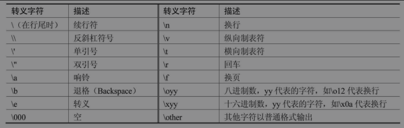
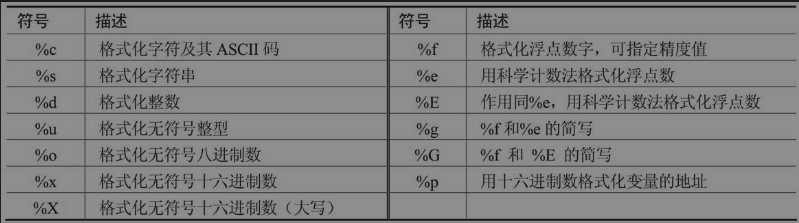
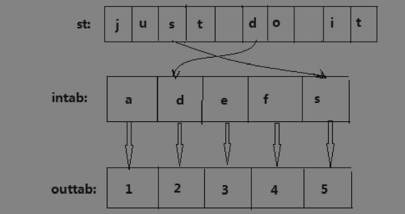

## 第三章：字符串

我们前面已经接触过字符串，也了解了一些基本操作，对字符串的创建、索引和分片等操作已经有了初步理解。

本章将介绍字符串的格式化、分割、搜索等方法。


### 1. 字符串的基本操作

字符串是Python中常用的数据类型，我们可以使用引号（'或"）创建字符串。

创建字符串很简单，只要为变量分配一个值即可，请看下面的例子：

```python
>>> field = 'hello'  # 创建字符串hello, 并赋值给变量field
>>>
```


所有标准序列操作（如索引、分片、成员资格、求长度、取最小值和最大值等）对字符串同样适用，我们在前面章节已经讲解了这些操作。

不过字符串是不可变的，所以字符串做不了分片赋值。请看如下操作：

```python
>>> field = 'just do it'
>>> field[-3:]
' it'
>>> field[-3:] = 'now'
Traceback (most recent call last):
  File "<stdin>", line 1, in <module>
TypeError: 'str' object does not support item assignment
>>> 
```

输出结果告诉我们str类型的对象不支持更改。


我们讲述了这么多字符串，还没有看到如何在输出语句中输出两行，这个操作该怎么实现呢？例如：

```python
>>> print('精诚所至\n金石为开')
精诚所至
金石为开
>>> 
```

输出结果为两行，这里使用了转义字符\n，表示换行。


Python中有很多转义符，下图列出了一些常用的转义字符。



对于前面的示例，若要以如下格式输出，则需要使用转义字符：

```markdown
'精诚所至'
'金石为开'
```

例如：

```python
>>> print(''精诚所至'\n'金石为开'')
  File "<stdin>", line 1
    print(''精诚所至'\n'金石为开'')
               ^
SyntaxError: invalid syntax
>>> print('\'精诚所至\'\n\'金石为开\'')
'精诚所至'
'金石为开'
>>> 
```

由操作结果可知，使用\'转义字符得到了想要的结果，不使用转义字符不能输出对应结果。在Python中进行字符串的操作时，如果涉及一些需要做转义的操作，就要使用转义字符。这些字符无须刻意记忆，先有一些了解即可，在后面的学习中结合实际操作会逐渐熟练使用。


### 2. 字符串格式化

到目前为止，我们对字符串的操作都停留在赋值、重新赋值、索引、分片和输出等一些比较基本的操作上，其实字符串还有更多、更好的操作方式，比如在实际项目开发中经常使用的字符串格式化操作。


##### 字符串格式化符号

字符串格式化使用操作符百分号（%）实现。

例如：

```python
>>> print('hello, %s' % 'world')
hello, world
>>> print('小智今年%s岁了' % 10)
小智今年10岁了
>>> 
```

由上面输入的内容可知，%左边放置了一个待格式化的字符串，右边放置的是希望格式化的值。格式化的值可以是一个字符串或数字。

格式化字符串的%s部分称为转换说明符，标记了需要放置转换值的位置，通用术语为占位符。可以想象成在学校上自习，我们通常会放一个物品在一个位置上，其他人一看就知道这个位置被占了，而我们无论什么时候去自习，直接到自己占好的位置坐下即可。这里可以把%s当作我们使用的物品，我们相当于后面%右边的值。

在上面的示例中，s表示百分号右边的值会被格式化为字符串，s指的是str。如果不是字符串，就会使用str将其转换为字符串。示例中就将10转换为字符串了，这种方式对大多数数值都有效。

这里提供了字符串格式化的方式，但若需要转换为其他格式，该怎么办呢？Python为我们提供了下图所示的格式化符号。



根据上图所示，前面的示例可以使用以下两种方式：

```python
>>> print('hello, %s' % 'world')
hello, world
>>> print('小智今年%d岁了' % 10)
小智今年10岁了
>>> 
```

由操作结果看到，整数既可以使用%s也可以使用%d进行格式化。


如果要格式化实数（浮点数），就可以使用%f进行格式化，例如：

```python
>>> print('圆周率PI的值为: %f' % 3.14)
圆周率PI的值为: 3.140000
>>> 
```

输出结果中有很多位小数，但传入的值只有两位小数，要解决这个问题可以使用格式化符号。


从上图可知，%f可指定精度值。在Python中，使用%f时，若不指定精度值，则默认输出6位小数。以指定2位小数为例，指定精度值的格式如下：

```python
%.2f
```

指定精度值的格式为一个英文格式下的句点加上希望保留的小数位数。因为格式化说明符以表示类型的字符结束，所以精度值应该放在类型字符前面。


使用这个格式更改上面圆周率输出的示例：

```python
>>> print('圆周率PI的值为: %.2f' % 3.14)
圆周率PI的值为: 3.14
>>> 
```

输出结果正是我们希望得到的。


上图中的符号不是所有都常用，比较常用的有%s、%d、%f三个，%e和%E在科学计算中使用比较多，其他符号了解就可以，有兴趣也可以自行研究。


假如我们要输出类似1.23%这样的结果，直接使用加号加一个百分号可以吗？尝试如下：

```python
>>> print('小智的识别能力比去年提高了：%.2f' % 1.23 + '%')
小智的识别能力比去年提高了：1.23%
```

输出结果得到了我们想要的，说明这种方式可以。不过输入的代码看起来怪怪的，有没有更好的办法呢？例如：

```python
>>> print('小智的识别能力比去年提高了：%.2f%%' % 1.23)
小智的识别能力比去年提高了：1.23%
>>> 
```

用这种方式也得到了我们想要的结果。不过我们在f字符后面使用了两个%，结果只输出了一个，这是怎么回事？


在Python中，字符串中的百分号是转换说明符，如果要输出%，就需要格式化字符%，从而需要使用%%。使用这种方式操作的功能类似：

```python
>>> print('输出百分号: %s' % '%')
输出百分号: %
>>> 
```


##### 字符串格式化元组

格式化操作符的右操作数可以是任何元素。如果是元组或映射类型（如字典，第5章进行讲解），那么字符串格式化将会有所不同。我们尚未涉及映射（字典），这里先了解一下元组。


如果右操作数是元组，其中每一个元素都会被单独格式化，每个值都需要一个对应的转换说明符，例如：

```python
>>> print('今年是%s年, 中国女排夺得本届奥运会%s, 中国工获得%d枚金牌' % ('2016', '冠军', 26))
今年是2016年, 中国女排夺得本届奥运会冠军, 中国工获得26枚金牌
>>> 
>>> print('今年是%s年, 中国女排夺得本届奥运会%s, 中国工获得%d枚金牌' % '2016', '冠军', 26)
Traceback (most recent call last):
  File "<stdin>", line 1, in <module>
TypeError: not enough arguments for format string
>>> 
```

由以上输出结果看到，在有多个占位符的字符串中，可以使用元组传入多个格式化值。如果需要转换的元组作为转换表达式的一部分存在，就必须将它用圆括号括起来，否则会出错。

**提示**：如果使用列表或其他序列代替元组，序列就会被解释为一个值。只有元组和字典可以格式化一个以上的值。


##### 转换操作符

下面介绍基本转换说明符。注意，这些项的顺序是至关重要的。

1. %字符：标记转换说明符开始。
2. 转换标志（可选）：-表示对齐；+表示在转换值之前要加上正负号；“”（空白字符）表示正数之前保留空格；0表示转换值位数不够时用0填充。
3. 最小字段宽度（可选）：转换后的字符串至少应该具有该值指定的宽度。如果是*，宽度就会从值元组中读出。
4. 点（.）后跟精度值（可选）：如果转换的是实数，精度值表示出现在小数点后的位数；如果转换的是字符串，该数字就表示最大字段宽度；如果是*，精度就会从元组中读出。
5. 转换类型: 详情看转换图表。


- 简单转换

  例如，输入以下代码：

  ```python
  >>> print('圆周率pi的值为: %.2f' % 3.14)
  圆周率pi的值为: 3.14
  ```

  由上面的输出结果可以看到，简单转换只需要写出转换类型，使用起来很简单。

  

- 字段宽度和精度

  转换说明符包括字段宽度和精度。字段宽度是转换后的值所保留的最小字符个数，精度是数字转换结果中应该包含的小数位数或字符串转换后的值所能包含的最大字符个数。

  ```python
  >>> print('圆周率pi的值为: %10f' % 3.141593)  # 字段宽度为10
  圆周率pi的值为:   3.141593  # 字符串宽度为10，字符串占据8个空格，剩余2个空格
  >>> print('保留两位小数, 圆周率pi的值为: %10.2f' % 3.141593)  # 字符串宽度为10
  保留两位小数, 圆周率pi的值为:       3.14  # 字符串宽度为10，字符串占据4个，剩余6个空格
  >>> print('保留两位小数, 圆周率pi的值为: %.2f' % 3.141593)
  保留两位小数, 圆周率pi的值为: 3.14  # 没有字段宽度参数
  >>> print('字符串精度获取: %.5s' % ('hello world'))  # 打印字符串前5个字符
  字符串精度获取: hello
  >>> 
  ```

  由输出结果可知，字段宽度和精度都是整数，并通过点号（.）分隔。两个都是可选参数，如果给出精度，就必须包含点号。

  

  再看以下代码：

  ```python
  >>> print('从元组中获取字符串精度: %*.*s' % (10, 5, 'hello world'))
  从元组中获取字符串精度:      hello
  >>> print('从元组中获取字符串精度: %.*s' % (5, 'hello world'))
  从元组中获取字符串精度: hello
  >>> 
  ```

  由输出结果看到，可以使用\*（星号）作为字段宽度或精度（或两者都用*），数值会从元组中读出。

  

- 符号、对齐和0填充

  开始介绍之前先看一个示例：

  ```python
  >>> print('圆周率PI的值为: %010.2f' % 3.141593)
  圆周率PI的值为: 0000003.14
  ```

  输出结果是不是怪怪的，这个我们称之为“标表”。在字段宽度和精度之前可以放置一个“标表”，可以是零、加号、减号或空格。零表示用0进行填充。

  

  减号（-）用来左对齐数值，例如：

  ```python
  >>> print('圆周率PI的值为: %-10.2f' % 3.141593)
  圆周率PI的值为: 3.14      # 此处右侧为多出的空格
  >>> 
  ```

  从输出结果看到，使用减号时，数字右侧多出了额外的空格。

  

  空白（“ ”）表示在正数前加上空格，例如：

  ```python
  >>> print(('% d' % 10) + '\n' + ('% d' % -10))
     10
    -10
  >>>
  ```

  由输出结果可以看到，该操作可以用于对齐正负数。

  

  加号（+）表示无论是正数还是负数都表示出符号，例如：

  ```python
  >>> print(('宽度前加 + 号: %+d' % 10) + '\n' + ('宽度前加 + 号: %+d' % -10))
  宽度前加 + 号: +10
  宽度前加 + 号: -10
  ```

  该操作也可以用于数值的对齐。

  

  从Python 3.6开始，引入了一种新的字符串：\_f-strings\_，格式化字符串。格式化字符串带'f'前缀，类似于str.format()接受的格式化字符串。它们包含由花括号括起来的替换字段。替换字段是表达式，它们会在运行时计算，然后使用format()协议进行格式化。

  

  \_f-strings\_使用方式如下：

  ```python
  >>> var_str = 'Python 3.7'
  >>> print(f'welcome to begin {var_str}')
  welcome to begin Python 3.7
  >>> 
  >>> import decimal
  >>> width = 10
  >>> precision = 4
  >>> value = decimal.Decimal('12.34567')
  >>> f'result: {value:{width}.{precision}}'
  'result:      12.35'
  >>>
  ```


### 3. 字符串方法

##### find() 方法

find()方法find()方法用于检测字符串中是否包含子字符串str。如果指定beg（开始）和end（结束）范围，就检查是否包含在指定范围内。如果包含子字符串，就返回开始的索引值；否则返回-1。

find()方法的语法如下：

```python
>>> field = 'do it now'
>>> field.find('do')
0
>>> field.find('now')
6
>>> field.find('python')
-1
>>> 
```

由输出结果看到，如果找到字符串，就返回对应的索引值；如果没找到字符串；就返回-1。

**提示**：字符串的find方法返回的不是布尔值。如果返回0，就表示在索引0处找到了字符串。


find方法还可以接受参数，用于表示起始点和结束点，例如：

```python
>>> field.find('it', 2)  # 提供起点
3
>>> field.find('it', 5)  # 提供起点
-1
>>> field.find('it', 0, 3)  # 提供起点和终点
-1
>>> field.find('it', 0, 5)
3
>>> field.find('it', 5, 10)
-1
>>>
```

由输出结果看到，可以通过使用起始值和终止值查找指定的范围内是否存在指定字符串。


##### join() 方法

join()方法用于将序列中的元素以指定字符连接成一个新字符串。

join()方法的语法如下：

```python
str.join(sequence)
```

此语法中，str代表指定检索的字符串，sequence代表要连接的元素序列。

返回结果为指定字符连接序列中的元素后生成的新字符串。


该方法使用示例如下：

```python
>>> num = [1, 2, 3, 4]
>>> mark = '+'
>>> mark.join(num)
Traceback (most recent call last):
  File "<stdin>", line 1, in <module>
TypeError: sequence item 0: expected str instance, int found
>>>
>>> num.join(mark)
Traceback (most recent call last):
  File "<stdin>", line 1, in <module>
AttributeError: 'list' object has no attribute 'join'
>>>
>>> field = ['1', '2', '3', '4', '5']
>>> print('连接字符串列表: ', mark.join(field))
连接字符串列表:  1+2+3+4+5
>>>
>>> field.join(mark)
Traceback (most recent call last):
  File "<stdin>", line 1, in <module>
AttributeError: 'list' object has no attribute 'join'
>>>
>>> dirs = '', 'home', 'data', 'hdfs'
>>> print('路径: ', '/'.join(dirs))
路径:  /home/data/hdfs
>>> 
```

由输出结果看到，进行join操作时，调用和被调用的对象都必须是字符串，任意一个不是字符串都会报错。


##### lower() 方法

lower()方法用于将字符串中所有大写字符转换为小写。

lower()方法的语法如下：

```python
str.lower()
```

此语法中，str代表指定检索的字符串，该方法不需要参数。返回结果为字符串中所有大写字符转换为小写后生成的字符串。


该方法使用示例如下：

```python
>>> field = 'DO IT NOW'
>>> print('调用lower得到的字符串: ',field.lower())
调用lower得到的字符串:  do it now
>>> 
>>> greeting = 'Hello,World'
>>> print('调用lower得到的字符串: ',greeting.lower())
调用lower得到的字符串:  hello,world
>>> 
```

由输出结果看到，字符串中的大写字母全部转换为小写字母了。


如果想要编写“不区分大小写”的代码，就可以使用lower方法。

如果想要在一个字符串中查找某个子字符串并忽略大小写，也可以使用lower方法，操作如下：

```python
>>> field = 'DO IT NOW'
>>> field.find('It')  # 都不转换为小写, 找不到匹配字符串-1
-1
>>> field.lower().find('It')  # 被查找字符串不转换为小写, 找不使用lower方法z
-1
>>> field.lower().find('It'.lower())  # 使用lower方法转换成小写后查找
3
>>> 
```

由输出结果看到，字符串全部转换为小写后能匹配到对应子串。

**提示**：有时类似于lower这样的字符串方法并不能如我们所愿进行工作。对于英文字符串，lower方法在处理时一点问题都没有；对于非英文字符串，lower方法在处理时可能不如我们的预期，如中文、挪威文等。


##### upper() 方法

upper()方法用于将字符串中的小写字母转换为大写字母。

upper()方法语法如下：

```python
str.upper()
```

此语法中，str代表指定检索的字符串，该方法不需要参数。返回结果为小写字母转换为大写字母的字符串。


该方法使用示例如下：

```python
>>> field = 'do it now'
>>> print('调用upper得到的字符串: ', field.upper())
调用upper得到的字符串:  DO IT NOW
>>> 
>>> greeting = 'Hello,World'
>>> print('调用upper得到的字符串: ', greeting.upper())
调用upper得到的字符串:  HELLO,WORLD
>>>
```

由输出结果看到，字符串中的小写字母全部转换为大写字母了。


如果想要编写“不区分大小写”的代码，就可以使用upper方法。

如果想要在一个字符串中查找某个子字符串并忽略大小写，也可以使用upper方法，操作如下：

```python
>>> field = 'do it now'
>>> field.find('It')  # 都不转换为大写, 找不到匹配字符串
-1
>>> field.upper().find('It')  # 被查找的字符串不转换为大写, 找不到匹配字符串
-1
>>> field.upper().find('It'.upper())  # 使用upper方法转换为大写后查找
3
>>>
```

由输出结果看到，字符串全部转换为大写后能找到对应子串。


##### swapcase() 方法

swapcase()方法用于对字符串的大小写字母进行转换，将字符串中的大写字母转换为小写、小写字母转换为大写。

swapcase()方法的语法如下：

```python
str.swapcase()
```

此语法中，str代表指定检索的字符串，该方法不需要参数。返回结果为大小写字母转换后生成的新字符串。


该方法使用示例如下：

```python
>>> field = 'Just do it, NOW'
>>> print('原字符串: ', field)
原字符串:  Just do it, NOW
>>> print('调用swapcase方法后得到的字符串: ', field.swapcase())
调用swapcase方法后得到的字符串:  jUST DO IT, now
>>>
```

由输出结果看到，调用该方法后，输出结果中的大写字母变为小写、小写字母变为大写。该方法进行大小写转换非常方便。


##### replace() 方法

replace()方法把字符串中的old（旧字符串）替换成new（新字符串），如果指定第3个参数max，替换次数就不超过max次。

replace()方法的语法如下：

```python
str.replace(old, new[, max])
```

此语法中，str代表指定检索的字符串；old代表将被替换的子字符串；new代表新字符串，用于替换old子字符串；max代表可选字符串，替换次数不超过max次。返回结果为字符串中的old（旧字符串）替换成new（新字符串）后生成的新字符串，如果指定第3个参数max，替换次数就不超过max次。


该方法使用示例如下：

```python
>>> field = 'do it now, do right now'
>>> print('原字符串: ', field)
原字符串:  do it now, do right now
>>> print('新字符串: ', field.replace('do', 'Just do'))
新字符串:  Just do it now, Just do right now
>>> print('新字符串: ', field.replace('o', 'Just', 1))
新字符串:  dJust it now, do right now
>>> print('新字符串: ', field.replace('o', 'Just', 2))
新字符串:  dJust it nJustw, do right now
>>> print('新字符串: ', field.replace('o', 'Just', 3))
新字符串:  dJust it nJustw, dJust right now
>>> 
```

由上面的输出结果看到，当不指定第3个参数时，所有匹配字符都替换；指定第3个参数时，替换从左往右进行，替换次数不超过指定次数。


##### split() 方法

split()方法通过指定分隔符对字符串进行切片，如果参数num有指定值，就只分隔num个子字符串。

这是一个非常重要的字符串方法，是join的逆方法，用来将字符串分割成序列。

split()方法的语法如下：

```python
>>> field = 'do it now'
>>> print('不提供任何分割符分割后的字符串: ', field.split())
不提供任何分割符分割后的字符串:  ['do', 'it', 'now']
>>> print('根据i分割后的字符串: ', field.split('i'))
根据i分割后的字符串:  ['do ', 't now']
>>> print('根据o分割后的字符串: ', field.split('o'))
根据o分割后的字符串:  ['d', ' it n', 'w']
>>> print('根据o分割1次后的字符串: ', field.split('o', 1))
根据o分割1次后的字符串:  ['d', ' it now']
>>> 
```

由输出结果看到，如果不提供分隔符，程序就会把所有空格作为分割符。操作中可以指定分割符和分割次数，若指定分割次数，则从左往右检索和分隔符匹配的字符，分割次数不超过指定次数；若不指定分割次数，则所有匹配的字符都会被分割。


##### strip() 方法

strip()方法用于移除字符串头尾指定的字符（默认为空格）。

strip()方法的语法如下：

```python
str.strip([chars])
```

此语法中，str代表指定检索的字符串，chars代表移除字符串头尾指定的字符。返回结果为移除字符串头尾指定的字符生成的新字符串。


该方法使用示例如下：

```python
>>> field = '----do it now----'
>>> print('原字符串: ', field)
原字符串:  ----do it now----
>>> print('新字符串: ', field.strip('-'))
新字符串:  do it now
>>> 
>>> st = '----do -- it -- now----'
>>> print('原字符串: ', st)
原字符串:  ----do -- it -- now----
>>> print('新字符串: ', st.strip('-'))
新字符串:  do -- it -- now
>>>
```

由操作结果看到，strip方法只去除头尾匹配的字符，中间匹配的字符不会去除。


##### translate() 方法

translate()方法根据参数table给出的表（包含256个字符）转换字符串的字符，将要过滤掉的字符放到del参数中。

translate()方法的语法如下：

```python
str.translate(table[, deletechars])
```

此语法中，str代表指定检索的字符串；table代表翻译表，翻译表通过maketrans方法转换而来；deletechars代表字符串中要过滤的字符列表。返回结果为翻译后的字符串。


该方法使用示例如下：

```python
>>> intab = 'adefs'
>>> outtab = '12345'
>>> trantab = str.maketrans(intab, outtab)
>>> st = 'just do it'
>>> print('st调用translate方法后: ', st.translate(trantab))
st调用translate方法后:  ju5t 2o it
>>>
```

由输出结果看到，有几个字符被替换成数字了，被替换的字符既在intab变量中，又在st变量中，如下图所示。对于既在intab中，又在st中的字符，使用outtab中对应的字符替换。由图4-1可知，intab中的字符d对应outtab中的字符2、字符s对应字符5，所以最后输出字符串中的s被替换成5、d被替换成2，这样就得到了最后我们看到的字符串ju5t 2o it。



translate方法和replace方法一样，可以替换字符串中某些部分。和replace方法不同的是，translate方法只处理单个字符。translate方法的优势在于可以同时进行多个替换，有时比replace方法效率高得多。


### 4. 小测试

已知一个字符hello，运用前面所学的知识并结合网络资源，打印如下结果：

1. hello的字符串长度
2. HELLO
3. Hello
4. hEllo
5. HeLLO
6. h,llo


示例如下，此处将使用第7章才讲解的str_transformers()函数来实现：

```python
>>> def str_transformers():
...     old_str = 'hello'
...     print('the length of old_str is:', len(old_str))
...     print('upper old_str is:', old_str.upper())
...     print('title old_str is:', old_str.title())
...     new_str = old_str.replace('e', 'E')
...     print('new_str is:', new_str)
...     print('swap case new_str is:', new_str.swapcase())
...     print('use \',\' join old_str is:', ','.join(old_str.split('e')))
... 
>>> 
>>> str_transformers()
the length of old_str is: 5
upper old_str is: HELLO
title old_str is: Hello
new_str is: hEllo
swap case new_str is: HeLLO
use ',' join old_str is: h,llo
>>> 
```

