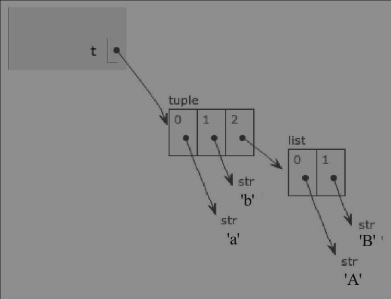
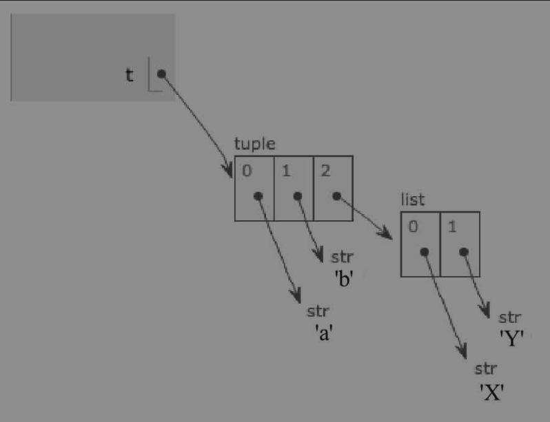

## 第二章：列表和元组

本章将引入一个新概念——数据结构。

数据结构是通过某种方式（如对元素进行编号）组织在一起的数据元素的集合，这些元素可以是数字或字符。

在Python中，最基本的数据结构是序列（Sequence）。Python包含6种内建序列，即列表、元组、字符串、Unicode字符串、buffer对象和xrange对象。本章重点讨论最常用的两种，即列表和元组。


### 1. 通用序列操作

在讲解列表和元组之前，本节先介绍 Python 中序列的通用操作，这些操作在列表和元组中都会用到。Python中所有序列都可以进行一些特定操作，包括索引（indexing）、分片（slicing）、序列相加（adding）、乘法（multiplying）、成员资格、长度、最小值和最大值。


##### 索引

序列是Python中最基本的数据结构。序列中的每个元素都分配一个数字，代表它在序列中的位置（索引），第一个索引是0，第二个索引是1，以此类推。

序列中所有元素都是有编号的，从0开始递增。可以通过编号分别对序列的元素进行访问。下面通过交互输入的方式介绍一个通过编号取元素的例子。

```python
>>> greeting = 'hello'
>>> greeting[0]
'h'
>>> greeting[1]
'e'
>>> greeting[2]
'l'
>>> 
```

可以看到，序列中的元素从0开始，从左向右依自然顺序编号，元素可以通过编号访问。

获取元素的方式为：在变量后加中括号，在中括号中输入所取元素的编号值。

这个格式需要记住。类似于我们平时排队，站成一排时，一般从左往右编号，编上序号后（一般从1开始编号，不会从0开始），当叫一个序号时，就会由序号对应到人。程序中的序列也是如此。这里的编号就是索引，可以通过索引获取元素。所有序列都可以通过这种方式进行索引。


上面的示例是从左往右通过编号获取元素的，是否可以从右往左通过编号获取元素呢？我们试一试，在交互模式下输入：

```python
>>> greeting = 'hello'
>>> greeting[-1]
'o'
>>> greeting[-2]
'l'
>>> greeting[-3]
'l'
>>> greeting[-4]
'e'
>>> 
```

可以看到，Python的序列也可以从右开始索引，最右边的元素索引值为-1，从右向左递减。在Python中，从左向右索引称为正数索引，从右向左索引称为负数索引。使用负数索引时，Python会从最后一个元素开始计数。最后一个元素的位置编号是-1。


从上面的几个示例可以看到，进行字符串的索引时都定义了一个变量，其实不定义变量也可以。下面来看一个例子，在交互模式下输入：

```python
>>> 'hello'[0]
'h'
>>> 'hello'[1]
'e'
>>> 'hello'[2]
'l'
>>> 'hello'[-1]
'o'
>>> 'hello'[-2]
'l'
>>> 
```

可以看到，直接使用索引，不定义变量进行引用也可以。直接使用索引的效果和定义变量的效果是一样的。


如果函数返回一个序列，是否可以直接对结果进行索引操作呢？在交互模式下输入：

```python
>>> thirdth = input()[0]
happy
>>> thirdth
'h'
>>> 
```

由输出结果可以看到，直接对函数的返回结果进行了索引操作。

索引既可以对变量的引用操作，也可以直接操作序列，还可以操作函数的返回序列。


##### 分片

索引用来对单个元素进行访问，使用分片可以对一定范围内的元素进行访问，分片通过冒号相隔的两个索引实现。在交互模式下输入：

```python
>>> number = [1, 2, 3, 4, 5, 6, 7, 8, 9, 10]
>>> number[1:3]  # 取索引为第一和第二的元素
[2, 3]
>>> number[-3:-1]  # 负数表明从右开始计数，取得倒数第三和倒数第二的元素
[8, 9]
>>> 
```

由操作结果可以看到，分片操作既支持正数索引，也支持负数索引，并且对于提取序列的一部分很方便。

分片操作的实现需要提供两个索引作为边界，第一个索引的元素包含在分片内，第二个索引的元素不包含在分片内。像数学里的a≤x＜b，x是我们需要得到的元素，a是分片操作中的第一个索引，b是第二个索引，b不包含在x的范围内。


对于上面的示例，假设需要访问最后3个元素，使用正数索引可以这样操作：

```python
>>> number = [1, 2, 3, 4, 5, 6, 7, 8, 9, 10]
>>> number[7:10]  # 取得最后三个元素
[8, 9, 10]
>>> 
```


由以上输入和我们前面对序列的定义可以得出，number的编号最大应该为9，编号为10指向的是第11个元素，是一个不存在的元素，但是由于在最后一个元素之后，因此能得到最后一个元素。这么做没问题。如果需要从列表的结尾开始，即使用负数索引，怎么办呢？我们尝试看看，输入如下：

```python
>>> number = [1, 2, 3, 4, 5, 6, 7, 8, 9, 10]
>>> number[-3:-1]
[8, 9]
>>> 
```

结果没有输出最后一个元素。再试试使用索引0作为最后一个元素的下一个元素，输入如下：

```python
>>> number[-3:0]
[]
>>> 
```

这个输出结果有点奇怪，竟然一个数值都没有。

事实上，只要在分片中最左边的索引比它右边的索引晚出现在序列中，结果就是一个空序列。比如上例中，-3代表倒数第3个元素，0代表第一个元素，倒数第3个元素比第一个元素晚出现，即排在第一个元素后面，所以得到的结果是空序列。


我们怎么通过负数索引的方式取得最后一个元素呢？这里有一个捷径可以使用。如果需要取得的分片包括序列结尾的元素，只需将第二个索引设置为空即可。输入如下：

```python
>>> number[-3:]
[8, 9, 10]
>>> 
```

输出结果和我们预期的一样。


正数索引能否使用这种方式呢？

输入如下：

```python
>>> number[0:]  # 从第一个元素开始输出，输出全部结果
[1, 2, 3, 4, 5, 6, 7, 8, 9, 10]
>>> number[:0]  # 最后一个元素为第一个，输出为空
[]
>>> number[:3]  # 取得前3个元素
[1, 2, 3]
>>> 
```

由输出结果可以知道也适用于正数索引。


根据上述输出结果可知，若需要输出整个序列，则可以将两个索引都设置为空。输入如下：

```python
>>> number[:]  # 取得整个列表
[1, 2, 3, 4, 5, 6, 7, 8, 9, 10]
>>> 
```

输出结果是整个序列。


进行分片时，分片的开始点和结束点都需要指定（无论是直接指定还是间接指定），用这种方式取连续的元素没有问题，但若要取序列中不连续的元素就比较麻烦，或者直接不能操作。

比如要取序列number中的所有奇数，以一个序列展示出来，用前面的方法就不能实现了。


对于上面这种情况，Python为我们提供了另一个参数——步长（step length），该参数通常是隐式设置的。

在普通分片中，步长是1。分片操作就是按照这个步长逐个遍历序列的元素，遍历后返回开始点和结束点之间的所有元素。也可以理解为默认步长是1，即没有设置步长时，步长隐式设置值为1。

输入如下：

```python
>>> number[0:10:1]
[1, 2, 3, 4, 5, 6, 7, 8, 9, 10]
>>> 
```


由上面的示例可以看到，分片包含另一个数字。这种方式就是步长的显式设置。看起来和隐式设置步长没什么区别，得到的结果也和之前一样。但若将步长设置为比1大的数，结果会怎样呢？

输入如下：

```python
>>> number[0:10:2]
[1, 3, 5, 7, 9]
>>> 
```

由上面的输出结果可以看到，对于number序列，设置步长为2时，得到的结果就是我们前面想要的奇数序列。


由结果可知，步长设置为大于1的数时，会得到一个跳过某些元素的序列。例如，我们上面设置的步长为2，得到的序列是从开始到结束每隔1个元素的序列。

比如还可以这样使用：

```python
>>> number[0:10:3]
[1, 4, 7, 10]
>>> number[2:6:3]
[3, 6]
>>> number[2:5:3]
[3]
>>> number[1:5:3]
[2, 5]
>>> 
```

由以上输出结果可以看到，使用步长的方式还是很灵活的。

除了上面的使用方式外，设置前面两个索引为空的捷径也可以使用。

操作如下：

```python
>>> number[::3]
[1, 4, 7, 10]
>>> 
```


上面的操作将序列中每3个元素的第一个提取出来，前面两个索引都设置为空。步长设置为0是否可行呢？

输入如下：

```python
>>> number[::0]
Traceback (most recent call last):
  File "<stdin>", line 1, in <module>
ValueError: slice step cannot be zero
>>> 
```

输出结果告诉我们步长不能为0。


步长是否可以为负数呢？

输入如下：

```python
>>> number[10:0:-2]
[10, 8, 6, 4, 2]
>>> number[0:10:-2]
[]
>>> number[::-2]
[10, 8, 6, 4, 2]
>>> number[5::-2]
[6, 4, 2]
>>> number[:5:-2]
[10, 8]
>>> number[::-1]
[10, 9, 8, 7, 6, 5, 4, 3, 2, 1]
>>> number[10:0:-1]  # 第二个索引为0，取不到序列中的第一个元素
[10, 9, 8, 7, 6, 5, 4, 3, 2]
>>> number[10::-1]  # 第二个索引为空，可以取到序列中的第一个元素
[10, 9, 8, 7, 6, 5, 4, 3, 2, 1]
>>> number[2::-1]  # 第二个索引为空，可以取到序列中的第一个元素
[3, 2, 1]
>>> number[2:0:-1]  # 第二个索引为0，取不到序列中的第一个元素
[3, 2]
>>> 
```

上面的输出结果好像不太好理解，使用负数步长时的结果怎么跟使用正数步长的结果相反呢？

这就是正数步长和负数步长的不同。对于正数步长，Python会从序列的头部开始向右提取元素，直到最后一个元素；对于负数步长，则是从序列的尾部开始向左提取元素，直到第一个元素。

正数步长必须让开始点小于结束点，而负数步长必须让开始点大于结束点。


##### 序列相加

使用加号可以进行序列的连接操作，输入如下：

```python
>>> [1, 2, 3] + [4, 5, 6]
[1, 2, 3, 4, 5, 6]
>>> a = [1, 2]
>>> b = [5, 6]
>>> a + b 
[1, 2, 5, 6]
>>> 
>>> s = 'hello'
>>> w = ' world'
>>> s + w
'hello world'
>>> 
```


由上面的输出结果可以看到，数字序列可以和数字序列通过加号连接，连接后的结果还是数字序列；字符串序列也可以通过加号连接，连接后的结果还是字符串序列。

数字序列是否可以和字符串序列相加，结果是数字序列还是字符串序列呢？输入如下：

```python
>>> [1, 2] + 'hello'
Traceback (most recent call last):
  File "<stdin>", line 1, in <module>
TypeError: can only concatenate list (not "str") to list
>>> 
>>> type([1, 2])
<class 'list'>
>>> type('hello')
<class 'str'>
>>> 
```

由上面的输出结果可以看到，数字序列和字符串序列不能通过加号连接。错误提示的信息是：只能列表和列表相连。

由试验结果可以得知：只有类型相同的序列才能通过加号进行序列连接操作，不同类型的序列不能通过加号进行序列连接操作。


##### 乘法

注意此处的乘法并不是数学中定义的乘法。

用一个数字x乘以一个序列会生成新的序列。在新的序列中，原来的序列将被重复x次，这就是序列中的乘法。在交互模式下输入：

```python
>>> 'hello' * 5
'hellohellohellohellohello'
>>> [7] * 10
[7, 7, 7, 7, 7, 7, 7, 7, 7, 7]
>>> 
```

从输出结果看到，序列被重复了对应的次数，而不是做了数学中的乘法运算。


在Python中，序列的乘法有什么特殊之处呢？

如果要创建一个重复序列，就可以像上面的示例一样乘以一个想要得到的序列长度的数字，这样可以快速得到需要的列表，非常方便。

空列表可以简单通过两个中括号（[]）表示，表示里面什么东西都没有。如果想创建一个占用10个或更多元素的空间，却不包括任何有用内容的列表，该怎么办呢？

我们可以像上面的示例一样乘以10或对应的数字，得到需要的空列表，也很方便。如果要初始化一个长度为x的序列，就需要让每个编码位置上都是空值，此时需要一个值代表空值，即里面没有任何元素，可以使用None。None是Python的内建值，确切含义是“这里什么也没有”。

例如，输入如下：

```python
>>> sq = [None] * 5
>>> sq
[None, None, None, None, None]
>>> 
```

从示例我们可以看到，Python中的序列乘法可以帮助我们快速做一些初始化操作。序列乘法做一些重复操作、空列表和None初始化操作还是挺方便的。


##### 成员资格

为了检查一个值是否在序列中，Python为我们提供了in运算符。

in运算符和前面讨论过的运算符有些不同。in运算符用于检验某个条件是否为真，并返回检验结果，检验结果为真返回True，为假返回False。

这种运算符称作布尔运算符，返回的真值叫作布尔值。关于布尔运算符的更多内容会在后续章节中进行介绍。

下面我们尝试使用in在交互模式下输入：

```python
>>> greeting = 'hello,world'
>>> 'w' in greeting  # 检测w是否在字符串中
True
>>> 'a' in greeting
False
>>> 
>>> users = ['xiaohong', 'xiaozhi', 'xiaoxiao']
>>> 'xiaohong' in users  # 检测字符串是否在字符串列表中
True
>>> 'xiaohua' in users
False
>>> 
>>> numbers = [1, 2, 3, 4, 5]
>>> 1 in numbers  # 检测数字是否在数字列表中
True
>>> 6 in numbers
False
>>> 'a' in numbers
False
>>> 
>>> eng = '** Study python is so happy **'
>>> '**' in eng  # 检测一些特殊字符是否在字符串中
True
>>> '$' in eng
False
>>> 'a' in eng
True
>>> 3 in eng
Traceback (most recent call last):
  File "<stdin>", line 1, in <module>
TypeError: 'in <string>' requires string as left operand, not int
>>> 
```

由上面的输出结果可以看到，使用in可以很好地检测字符或数字是否在对应的列表中。

并且可以看出，数字类型不能在字符串类型中通过 in 进行成员资格检测，而字符串类型可以在数字列表中通过 in 进行成员资格检测。


##### 长度、最小值和最大值

Python为我们提供了长度、最大值和最小值的内建函数，对应的内建函数分别为len、max和min。

这3个函数该怎么使用呢？在交互模式下输入：

```python
>>> numbers = [300, 200, 100, 800, 500]
>>> len(numbers)
5
>>> max(numbers)
800
>>> min(numbers)
100
>>> max(5, 3, 10, 7)
10
>>> min(7, 0, 3, -1)
-1
>>> len(1, 2, 3, 4, 5)
Traceback (most recent call last):
  File "<stdin>", line 1, in <module>
TypeError: len() takes exactly one argument (5 given)
>>> len([1, 2, 3, 4, 5])
5
```

由上面的结果可以看到，len函数返回序列中所包含元素的数量，max函数和min函数分别返回序列中最大和最小的元素。

在该示例中，前面几个函数的输入参数都是序列，可以使用前面的解释理解。max函数和min函数的参数可以不是一个序列，而是以多个数字直接作为参数，此处直接求取多个数字的最大值和最小值。


### 2. 列表

前面已经用了很多次列表，可以看出列表的功能是比较强大的。

本节将讨论列表不同于元组和字符串的地方：列表的内容是可变的（mutable）。列表有很多比较好用、比较独特的方法，本节将一一进行介绍。


##### 更新列表

我们在第1节中所讲述的有关序列的操作，如索引、分片、相加、乘法等都适用于列表。

本节将介绍一些序列中没有而列表中有的方法，这些方法的作用都是更新列表，有元素赋值、增加元素、删除元素、分片赋值等。下面逐一进行介绍。


##### 元素赋值

我们前面学习过赋值语句，赋值语句是最简单的改变列表的方式，如a=2就属于一种改变列表的方式。

这里我们将通过编号标记某个特定位置的元素，并对该位置的元素重新赋值，如a[1]=10。

在交互模式下输入如下：

```python
>>> a = [1, 2, 3, 2, 1]
>>> a[1] = 10
>>> a
[1, 10, 3, 2, 1]
>>> a[3] = 10
>>> a
[1, 10, 3, 10, 1]
>>> 
```

还记得我们的编号是从0开始的么！？


从上面的输出结果可以得知，我们可以根据编号对列表中某个元素重新赋值。既然可以重新赋值，是否可以赋不同类型的值呢？我们尝试一下。

输入如下：

```python
>>> a[2] = 'hello'  # 对编号为2的元素赋值，赋值成字符串
>>> a
[1, 10, 'hello', 10, 1]
>>> type(a)
<class 'list'>
>>> type(a[1])
<class 'int'>
>>> type(a[2])
<class 'str'>
>>> 
```

由上面的输出结果可以得知，可以对一个列表中的元素赋不同类型的值。比如上面的示例，列表a中既有int类型的值，也有str类型的值。


假如对列表赋值时使用的编号超过了列表中的最大编号，是否还可以赋值呢？我们尝试一下，输入如下：

```python
>>> list_data = [1, 2, 3]
>>> list_data[3] = 'test'
Traceback (most recent call last):
  File "<stdin>", line 1, in <module>
IndexError: list assignment index out of range
>>> 
```

在上面的示例中，list_data的最大编号是2，当给编号为3的元素赋值时就会出错。

由此得知：不能为一个不存在元素的位置赋值。


如果一定要赋值，前面学习的序列通用操作中的乘法可以帮助我们，输入如下：

```python
>>> list_data = [None] * 5
>>> list_data[3] = 'test'
>>> list_data
[None, None, None, 'test', None]
>>> 
```

由以上输出结果可以得知，可以对初始化过的位置进行赋值。


##### 增加元素

由元素赋值的示例可以看到，不能为一个不存在的位置赋值。一旦初始化了一个列表，就不能再往这个列表中增加元素了。

若需要往列表中增加元素，则需要将整个列表中的元素都复制一遍，再添加需要增加的元素。Python中是否提供对应的方法帮助我们做这件事情呢？答案是肯定的。

输入如下：

```python
>>> list_data = [1, 2, 3]
>>> list_data.append(4)
>>> list_data
[1, 2, 3, 4]
>>> 
```

由示例看到，可以使用append()方法解决前面的困惑。

append()方法是一个用于在列表末尾添加新对象的方法。

该方法的语法如下：

```python
list.append(obj)
```

此语法中list代表列表，obj代表需要添加到list列表末尾的对象。


由前面的输出结果得知：append()方法不是简单地返回一个修改过的新列表，而是直接修改原来的列表。

下面展示几个append()的示例：

```python
>>> int_data = [1, 2, 3]
>>> int_data.append('test')  # 添加字符串
>>> int_data
[1, 2, 3, 'test']
>>> str_data = ['a', 'b', 'c']
>>> str_data.append(3)  # 添加数字
>>> str_data
['a', 'b', 'c', 3]
>>> 
```

由上面的示例可以得知：可以往数字序列中添加字符串，也可以往字符串序列中添加数字。


##### 删除元素

前面学习了往列表中增加元素，是否可以在列表中删除元素呢？

例如下面的示例：

```python
>>> str_list = ['a', 'b', 'c', 'd', 'e']
>>> len(str_list)
5
>>> del str_list[1]
>>> print('删除第二个元素: ', str_list)
删除第二个元素:  ['a', 'c', 'd', 'e']
>>> len(str_list)
4
>>> 
```

由上面的示例看到，可以使用del删除列表中的元素。

上面的示例使用del删除了str_list列表中的第二个元素，删除元素后，原来有5个元素的列表变成只有4个元素的列表了。

使用del除了可以删除列表中的字符外，也可以删除列表中的数字。

输入如下：

```python
>>> nums = [1, 2, 3]
>>> len(nums)
3
>>> del nums[2]
>>> print('删除第三个元素后: ', nums)
删除第三个元素后:  [1, 2]
>>> len(nums)
2
>>> 
```

上面的输出结果已经从数字列表中删除了对应的数字。

除了删除列表中的元素外，del还能用于删除其他元素，具体在后续章节会做详细介绍。


##### 分片赋值

分片赋值是列表一个强大的特性。

先看下面的示例：

```python
>>> list('女排夺冠了')
['女', '排', '夺', '冠', '了']
>>> str_list = list('女排夺冠了')
>>> str_list
['女', '排', '夺', '冠', '了']
>>> show = list('hi,boy')
>>> show
['h', 'i', ',', 'b', 'o', 'y']
>>> show[3:] = list('man')
>>> show
['h', 'i', ',', 'm', 'a', 'n']
>>> 
```

由上述示例可以看出，可以通过分片赋值直接对列表进行变更。

示例中我们通过分片操作变更了编号3之后位置的元素，即将boy替换为man了。


上述示例中引入了一个新函数——list()函数。

list()函数可以直接将字符串转换为列表。

该函数的一个功能就是根据字符串创建列表，有时这么操作会很方便。list()函数不仅适用于字符串，所有类型的序列它都适用。


除了上面展示的功能，分片赋值还有什么强大的功能呢？先看下面的示例：

```python
str_list = list('hi')
>>> str_list
['h', 'i']
>>> 
>>> str_list[1:] = list('ello')
>>> str_list
['h', 'e', 'l', 'l', 'o']
>>> 
```

我们分析一下，前面给greeting赋的值是［'h', 'i'］，后面通过分片赋值操作将编号1之后的元素变更了，即将编号1位置的元素替换为e了，但是编号2之后没有元素，怎么能操作成功呢？并且一直操作到编号为4的位置，这怎么可以？这就是分片赋值另一个强大的功能，可以使用与原序列不等长的序列将分片替换。


还有没有其他功能呢？请看下面的示例：

```python
>>> field = list('ae')
>>> field
['a', 'e']
>>> field[1:1] = list('bcd')
>>> field
['a', 'b', 'c', 'd', 'e']
>>> str_list = list('女排夺冠了')
>>> str_list
['女', '排', '夺', '冠', '了']
>>> str_list[2:2] = list('2016年奥运会')
>>> str_list
['女', '排', '2', '0', '1', '6', '年', '奥', '运', '会', '夺', '冠', '了']
>>> 
```

从上面的示例可以看出，可以在不替换任何原有元素的情况下在任意位置插入新元素。同学们可自行尝试在上面示例的其他位置进行操作。

当然，上面的示例程序只是“替换”了一个空分片，实际操作是插入一个序列。

通过该示例是否想起了前面的append()方法，不过分片赋值比append()方法强大多了，append()方法只能在列表尾部增加元素，而分片赋值可以在任意位置增加元素。


看到这里，是否同时想起了前面删除元素的操作，分片赋值是否支持类似删除的功能呢？是的，支持类似删除的功能。下面我们证实一下这个猜想。

```python
>>> field = list('abcde')
>>> field
['a', 'b', 'c', 'd', 'e']
>>> field[1:4] = []
>>> field
['a', 'e']
>>> str_list = list('女排2016年奥运会夺冠了')
>>> str_list
['女', '排', '2', '0', '1', '6', '年', '奥', '运', '会', '夺', '冠', '了']
>>> str_list[2:10] = []
>>> str_list
['女', '排', '夺', '冠', '了']
>>> field = list('abcde')
>>> del field[1:4]
>>> field
['a', 'e']
```

从上面的示例可以看到，使用了前面插入操作的逆操作证实我们的猜想。

删除和插入一样，可以对一个序列中任意位置的元素进行删除。所以通过分片赋值删除元素也是可行的，并且分片赋值删除的功能和del删除的操作结果是一样的。


##### 嵌套列表

前面介绍的都是单层的列表，列表是否可以嵌套呢？

我们做如下尝试：

```python
>>> field = ['a', 'b', 'c']
>>> field
['a', 'b', 'c']
>>> nums = [1, 2, 3]
>>> nums
[1, 2, 3]
>>> mix = [field, nums]
>>> mix
[['a', 'b', 'c'], [1, 2, 3]]
>>> mix[0]
['a', 'b', 'c']
>>> mix[1]
[1, 2, 3]
>>> 
```

由上面的操作结果得知，在列表中可以嵌套列表，嵌套的列表取出后还是列表。


##### 列表方法

之前的章节介绍了函数，本节介绍一个与函数密切相关的概念——方法。

方法是与对象有紧密联系的函数，对象可能是列表、数字，也可能是字符串或其他类型的对象。

方法的调用方式前面有一个示例，调用语法如下：

```python
对象.方法(参数)
```

由上面的语法和前面append()方法的示例可知：

- 方法的定义方式是将对象放到方法名之前，两者之间用一个点号隔开，方法后面的括号中可以根据需要带上参数。除了语法上有一些不同外，方法调用和函数调用很相似。

列表中有count、index、sort等比较常用的方法，下面逐一进行介绍。


- append

  - 该方法前面已经介绍过，功能是在列表的末尾添加新对象。使用方式为：

    ```python
    list.append(obj)
    ```

  

- count

  - count()方法用于统计某个元素在列表中出现的次数。

  - count()方法的语法如下：

    ```python
    list.count(obj)
    
    # 此语法中，list代表列表，obj代表列表中统计的对象。
    ```

    使用该方法示例如下：

    ```python
    >>> field = list('hello,world')
    >>> field
    ['h', 'e', 'l', 'l', 'o', ',', 'w', 'o', 'r', 'l', 'd']
    >>> print('列表field中，字母o的个数: ', field.count('o'))
    列表field中，字母o的个数:  2
    >>> print('列表field中，字母l的个数: ', field.count('l'))
    列表field中，字母l的个数:  3
    >>> print('列表field中，字母a的个数: ', field.count('a'))
    列表field中，字母a的个数:  0
    >>> list_obj = [123, 'hello', 'world', 123]
    >>> list_obj = [26, 'hello', 'world', 26]
    >>> print('数字26的个数: ', list_obj.count(26))
    数字26的个数:  2
    >>> print('hello的个数: ', list_obj.count('hello'))
    hello的个数:  1
    >>> ['a', 'c', 'a', 'f', 'a'].count('a')
    3
    >>> mix = [[1,3], 5, 6, [1,3], 2]
    >>> print('嵌套列表mix中列表[1, 3]的个数为: ', mix.count([1, 3]))
    嵌套列表mix中列表[1, 3]的个数为:  2
    >>> 
    ```

    

- extend

  - extend()方法用于在列表末尾一次性追加另一个序列中的多个值（用新列表扩展原来的列表）。

  - extend()方法的语法如下：

    ```python
    list.extend(seq)
    
    # 此语法中，list代表被扩展的列表，seq代表需要追加到list中的元素列表。
    ```

    使用该方法的示例如下：

    ```python
    >>> a = ['hello', 'world']
    >>> b = ['python', 'is', 'funny']
    >>> a.extend(b)
    >>> a
    ['hello', 'world', 'python', 'is', 'funny']
    >>> 
    ```
    
    
    
    以上操作结果看起来很像连接操作。extend()方法和序列相加有什么区别呢？我们先看看下面的示例：
    
    ```python
    >>> a = ['hello', 'world']
    >>> b = ['python', 'is', 'funny']
    >>> a + b
    ['hello', 'world', 'python', 'is', 'funny']
    >>> a
    ['hello', 'world']
    ```
    
    从输出的结果可以看出，两个示例中a和b的赋值是一样的，但第一个示例中输出a的值和第二个示例中输出a的值不一样。
    
    由此我们得出，extend()方法和序列相加的主要区别是：extend()方法修改了被扩展的序列，如前面的a；原始的连接操作会返回一个全新的列表，如上面的示例，返回的是一个包含a和b副本的新列表，而不会修改原始的变量。
    
    
    
    当然，上述示例也可以用前面学习的分片赋值实现相同的结果，输入如下：
    
    ```python
    >>> a = ['hello', 'world']
    >>> b = ['python', 'is', 'funny']
    >>> a[len(a):] = b
    >>> a
    ['hello', 'world', 'python', 'is', 'funny']
    ```
    
    可以看到，输出结果和使用extend()方法一样，不过看起来没有extend()方法易懂，因此不会选择这个方案。
  
  
  
- index

  - index()方法用于从列表中找出某个值第一个匹配项的索引位置。

  - index()方法的语法如下：

    ```python
    list.index(obj)
    # 此语法中，list代表列表，obj代表查找的对象。
    ```

    

    使用该方法的示例如下：

    ```python
    >>> field = ['hello', 'world', 'python', 'is', 'funny']
    >>> print('hello的索引位置为: ', field.index('hello'))
    hello的索引位置为:  0
    >>> print('python的索引位置为: ', field.index('python'))
    python的索引位置为:  2
    >>> print('abc的索引位置为: ', field.index('abc'))
    Traceback (most recent call last):
      File "<stdin>", line 1, in <module>
    ValueError: 'abc' is not in list
    ```

    由上面的示例看到，搜索单词hello，会发现它在索引号为0的位置；搜索单词python，它在索引号为2的位置，索引得到的位置跟元素在序列中的位置一样。如果搜索列表中不存在的字符串，操作结果就会出错，所以对于不在列表中的元素，用index()方法操作时会报错。

  

- insert

  - insert()方法用于将对象插入列表。

  - insert()方法的语法如下：

    ```python
    list.insert(index, obj)
    
    # 此语法中，list代表列表，index代表对象obj需要插入的索引位置，obj代表要插入列表中的对象。
    ```

    

    使用该方法的示例如下：

    ```python
    >>> nums = [1, 2, 3]
    >>> print('插入之前的nums: ', nums)
    插入之前的nums:  [1, 2, 3]
    >>> nums.insert(2, '插入位置在2之后，3之前')
    >>> print('插入之后的nums: ', nums)
    插入之后的nums:  [1, 2, '插入位置在2之后，3之前', 3]
    ```

    由上面的示例看到，insert()方法操作挺方便的。

    

    与extend()方法一样，insert()方法的操作也可以使用我们前面学习的分片赋值实现。

    ```python
    >>> nums = [1, 2, 3]
    >>> print('插入之前的nums: ', nums)
    插入之前的nums:  [1, 2, 3]
    >>> nums[2:2] = ['插入位置在2之后，3之前']
    >>> print('插入之后的nums: ', nums)
    插入之后的nums:  [1, 2, '插入位置在2之后，3之前', 3]
    >>> 
    ```

    输出结果和insert操作的结果一样，但看起来没有使用insert容易理解，应该不会选择这个方案。

  

- pop

  - pop()方法用于移除列表中的一个元素（默认最后一个元素），并且返回该元素的值。

  - pop()方法的语法如下：

    ```python
    list.pop(obj=list[-1])
    ```

    此语法中，list代表列表，obj为可选择的参数，代表要移除列表元素的对象。

    

    使用该方法的示例如下：

    ```python
    >>> field = ['hello', 'world', 'python', 'is', 'funny']
    >>> field.pop()  # 不传参数，默认移除最后一个元素
    'funny'
    >>> print('移除元素后的field: ', field)
    移除元素后的field:  ['hello', 'world', 'python', 'is']
    >>> field.pop(3)  # 移除编号为3的元素
    'is'
    >>> print('移除元素后的field: ', field)
    移除元素后的field:  ['hello', 'world', 'python']
    >>> field.pop(0)
    'hello'
    >>> print('移除元素后的field: ', field)
    移除元素后的field:  ['world', 'python']
    >>>
    ```

    由上面的示例看到，调用pop方法移除元素时，在交互模式下会告知我们移除了哪个元素，如上面示例中的funny、is。移除funny时未传参数，默认移除最后一个；is的移除则是根据传入的编号3进行的。

    提示：*pop方法是唯一一个既能修改列表又能返回元素值（除了None外）的列表方法。*

    

    使用pop方法可以实现一种常见的数据结构——栈。

    栈的原理就像堆放盘子一样，一次操作一个盘子，要将若干盘子堆成一堆，只能在一个盘子的上面放另一个盘子；要拿盘子时，只能从顶部一个一个往下拿，最后放入的盘子是最先被拿的。栈也是这样，最后放入栈的最先被移除，称为LIFO（Last In First Out），即后进先出。

    栈中的放入和移除操作有统一的称谓——入栈（push）和出栈（pop）。Python没有入栈方法，但可以使用append方法代替。pop方法和append方法的操作结果恰好相反，如果入栈（或追加）刚刚出栈的值，最后得到的结果就不会变。

    

    例如以下操作：

    ```python
    >>> nums = [1, 2, 3]
    >>> nums.append(nums.pop())  # 追加默认出栈的值
    >>> print('nums追加默认出栈值的操作结果: ', nums)
    nums追加默认出栈值的操作结果:  [1, 2, 3]
    >>> 
    
    ```

    由上面的操作结果看到，通过追加默认出栈的值得到的列表和原来是一样的。

  

- remove

  - remove()方法用于移除列表中某个值的第一个匹配项。

  - remove()方法的语法如下：

    ```python
    list.remove(obj)
    
    # 此语法中，list代表列表，obj为列表中要移除的对象。
    ```

    

    使用该方法的示例如下：

    ```python
    >>> field = ['女排', '精神', '中国', '精神', '学习', '精神']
    >>> print('移除列表之前的field: ', field)
    移除列表之前的field:  ['女排', '精神', '中国', '精神', '学习', '精神']
    >>> field.remove('精神')
    >>> print('移除列表之后的field: ', field)
    移除列表之后的field:  ['女排', '中国', '精神', '学习', '精神']
    >>> field.remove('abc')  # 删除列表中不存在的元素
    Traceback (most recent call last):
      File "<stdin>", line 1, in <module>
    ValueError: list.remove(x): x not in list
    ```

    由上面的输出结果看到，只有第一次出现的值被移除了，第二次之后出现的值没有被移除。上面的列表中有3个“精神”，调用移除方法后，删除了第一个，后面两个仍然存在。同时，操作移除列表中不存在的值是不行的，系统会告知移除的对象不在列表中。

    有一点需要了解的是：remove没有返回值，是一个直接对元素所在位置变更的方法，它修改了列表却没有返回值，与pop方法正好相反。

  

- reverse

  - reverse()方法用于反向列表中的元素。

  - reverse()方法的语法如下：

    ```python
    list.reverse()
    
    # 此语法中，list代表列表，该方法不需要传入参数。
    ```

    

  - 使用该方法的示例如下：

    ```python
    >>> nums = [1, 2, 3]
    >>> print('列表反转前的nums: ', nums)
    列表反转前的nums:  [1, 2, 3]
    >>> nums.reverse()
    >>> print('列表反转后: ', nums)
    列表反转后:  [3, 2, 1]
    >>> 
    ```

    由上面的输出结果看到，该方法改变了列表但不返回值（和前面的remove一样）。

    

    如果需要对一个序列进行反向迭代，那么可以使用reversed函数。这个函数并不返回列表，而是返回一个迭代器（Iterator）对象（该对象在后面会详细介绍），可以通过list函数把返回的对象转换为列表，例如：

    ```python
    >>> nums = [1, 2, 3]
    >>> print('使用reversed函数反转结果: ', list(reversed(nums)))
    使用reversed函数反转结果:  [3, 2, 1]
    >>> 
    ```

  

- sort

  - sort()方法用于对原列表进行排序，如果指定参数，就使用参数指定的比较方法进行排序。

  - sort()方法的语法如下：

    ```python
    list.sort(func)
    
    # 此语法中，list代表列表，func为可选参数。如果指定该参数，就会使用该参数的方法进行排序。
    ```

    

    使用该方法的示例如下：

    ```python
    >>> nums = [5, 8, 1, 3, 6]
    >>> nums.sort()
    >>> print('nums调用sort方法后: ', nums)
    nums调用sort方法后:  [1, 3, 5, 6, 8]
    >>> 
    ```

    由上面输出的结果得知，sort方法改变了原来的列表，而不是简单地返回一个已排序的列表副本。

    

    我们前面学习过几个改变列表却不返回值的方法（如append），不能将操作结果赋给一个变量，这样的行为方式很合常理。但当用户需要一个排好序的列表副本，同时又保留原有列表不变时，可能会做如下操作：

    ```python
    >>> nums = [5, 8, 1, 3, 6]
    >>> n = nums.sort()
    >>> print('变量n的结果是: ', n)
    变量n的结果是:  None
    >>> print('列表nums排序后的结果是: ', nums)
    列表nums排序后的结果是:  [1, 3, 5, 6, 8]
    >>> 
    ```

    输出结果怎么和我们预期的不一样呢？因为sort方法修改了列表num，但是返回的是空值，所以我们最后得到的是已排序的num和值为None的n。该想法正确的实现方式是先把num的副本赋值给n，然后对n进行排序。

    操作如下：

    ```python
    >>> nums = [5, 8, 1, 3, 6]
    >>> n = nums  # 直接将列表nums赋值给n
    >>> n.sort()
    >>> print('变量n的结果是: ', n)
    变量n的结果是:  [1, 3, 5, 6, 8]
    >>> print('nums的结果是: ', nums)  # nums也被排序了
    nums的结果是:  [1, 3, 5, 6, 8]
    >>> 
    >>> nums = [5, 8, 1, 3, 6]
    >>> n = nums[:]  # 将列表nums切片赋值给n
    >>> n.sort()
    >>> print('变量n的结果是: ', n)
    变量n的结果是:  [1, 3, 5, 6, 8]
    >>> print('nums的结果是: ', nums)
    nums的结果是:  [5, 8, 1, 3, 6]
    ```

    由上面的执行结果可以看到，若不将原列表（如列表num）分片后赋值给另一个变量（如n），则两个列表都会被排序，这样简单的赋值后，两个列表都指向同一个列表。由此提醒进行该操作时要记得对原列表分片。

    

    如reverse方法一样，sort方法也有一个有同样功能的函数——sorted函数。该函数可以直接获取列表的副本进行排序，使用方式如下：

    ```python
    >>> nums = [5, 8, 1, 3, 6]
    >>> n = sorted(nums)
    >>> print('变量n的操作结果是: ', n)
    变量n的操作结果是:  [1, 3, 5, 6, 8]
    >>> print('nums的结果是: ', nums)  # nums保持原样
    nums的结果是:  [5, 8, 1, 3, 6]
    >>> 
    ```

    执行结果和前面操作的一样。

    

    sorted函数可以用于任何序列，返回结果都是一个列表。例如下面的操作：

    ```python
    >>> sorted('python')
    ['h', 'n', 'o', 'p', 't', 'y']
    >>> sorted('321')
    ['1', '2', '3']
    >>> 
    ```

  

- clear

  - clear()方法用于清空列表，类似于del a[:]。

  - clear()方法的语法如下：

    ```python
    list.clear()
    
    # 此语法中，list代表列表，不需要传入参数。
    ```

    

    使用该方法的示例如下：

    ```python
    >>> field = ['study', 'python', 'is', 'happy']
    >>> field.clear()
    >>> print('field调用clear方法后的结果: ', field)
    field调用clear方法后的结果:  []
    ```

    由操作结果看到，clear方法会清空整个列表，调用该方法进行清空很简单，但也要小心，因为一不小心就可能把整个列表都清空了。

  

- copy

  - copy()方法用于复制列表，类似于a[:]。

  - copy()方法的语法如下：

    ```python
    list.copy()
    
    # 此语法中，list代表列表，不需要传入参数。
    ```

    

    使用该方法的示例如下：

    ```python
    >>> field = ['study', 'python', 'is', 'happy']
    >>> copy_field = field.copy()
    >>> print('复制操作结果: ', copy_field)
    复制操作结果:  ['study', 'python', 'is', 'happy']
    >>> 
    ```

    操作结果和该方法的意思一样，是原原本本的复制操作。

  

- 高级排序

  - 如果希望元素按特定方式进行排序（不是sort方法默认的按升序排列元素），就可以自定义比较方法。sort方法有两个可选参数，即key和reverse。要使用它们，就要通过名字指定，我们称之为关键字参数。例如下面的示例：

    ```python
    >>> field = ['study', 'python', 'is', 'happy']
    >>> field.sort(key=len)  # 按字符串由短到长排序
    >>> field
    ['is', 'study', 'happy', 'python']
    >>> field.sort(key=len, reverse=True)  # 按字符串由长到短排序，传递两个参数
    >>> field
    ['python', 'study', 'happy', 'is']
    >>> 
    >>> nums = [5, 8, 1, 3, 6]
    >>> nums.sort(reverse=True)  # 排序后逆序
    >>> nums
    [8, 6, 5, 3, 1]
    >>> 
    ```

    由上面的操作结果可知，sort方法带上参数后的操作是很灵活的，可以根据自己的需要灵活使用该方法。关于自定义函数，后续章节会有更详细的介绍。


### 3. 元组

Python的元组与列表类似，不同之处在于元组的元素不能修改（前面多次提到的字符串也是不能修改的）。创建元组的方法很简单：如果你使用逗号分隔了一些值，就会自动创建元组。

例如，我们如下输入：

```python
>>> 1,2,3
(1, 2, 3)
>>> 'hello','world'
('hello', 'world')
>>> 
```

上面的操作用逗号分隔了一些值，结果输出的是元组。


我们经常使用圆括号将值括起来，例如：

```python
>>> (1, 2, 3)
(1, 2, 3)
>>> ('hello', 'world')
('hello', 'world')
>>> 
```


还可以创建空元组，操作如下：

```python
>>> ()
()
```

如果圆括号中不包含任何内容，就是一个空元组。


输出结果不是元组，包含一个值的元组的实现方式有一些奇特，必须在括号中的元素后加一个逗号，例如：

```python
>>> (1,)
(1,)
```

由上面的示例看到，逗号很重要，只添加括号是没有用的。

下面我们介绍元组的相关操作。


##### tuple函数

tuple函数的功能和list函数基本上一样，都是以一个序列作为参数，并把它转换为元组。如果参数是元组，参数就会被原样返回，例如：

```python
>>> tuple(['hello','world'])
('hello', 'world')
>>> tuple('hello')
('h', 'e', 'l', 'l', 'o')
>>> tuple(('hello','world'))  # 参数是元组
('hello', 'world')
>>> 
```

由上面的操作看到，tuple函数传入元组参数后，得到的返回值就是传入的参数。


##### 元组的基本操作

和列表一样，元组也有一些基本操作，如访问元组、修改元组、删除元组、索引和截取等操作。当然，这里的修改、删除和截取等操作和列表的操作不太一样。


##### 访问元组

可以使用下标索引访问元组中的值，例如：

```python
>>> mix = ('hello', 'world', 2015, 2016)
>>> print('mix[1] is: ', mix[1])
mix[1] is:  world
>>> num = (1, 2, 3, 4, 5, 6, 7)
>>> print('num[1:5] is: ', num[1:5])
num[1:5] is:  (2, 3, 4, 5)
>>> 
```


##### 修改元组

元组中的元素值不允许修改，但可以对元组进行连接组合，例如：

```python
>>> field = ('hello', 'world')
>>> num = (2015, 2016)
>>> print('合并结果为: ', field + num)
合并结果为:  ('hello', 'world', 2015, 2016)
>>> 
```


##### 删除元组

元组中的元素值不允许删除，但可以使用del语句删除整个元组，例如：

```python
>>> field = ('hello', 'world')
>>> del field
>>> print('删除后的结果: ', field)
Traceback (most recent call last):
  File "<stdin>", line 1, in <module>
NameError: name 'field' is not defined
>>> 
```

以上实例的元组被删除后，输出变量会有异常信息，输出结果告诉我们field没有定义，即field已经不存在了。


##### 元组索引、截取

因为元组也是一个序列，所以可以访问元组中指定位置的元素，也可以截取索引中的一段元素，例如：

```python
>>> field = ('hello', 'world', 'welcome')
>>> field[2]
'welcome'
>>> field[-2]
'world'
>>> field[1:]
('world', 'welcome')
>>> 
```


##### 元组内置函数

Python元组提供了一些内置函数，如计算元素个数、返回最大值、返回最小值、列表转换等函数。

- len(tuple)用于计算元组元素的个数。使用方式如下：

  ```python
  >>> tup = ('hello', 'world', 'welcome')
  >>> len(tup)
  3
  ```

  

- max(tuple)用于返回元组中元素的最大值。使用方式如下：

  ```python
  >>> tup = ('6', '3', '8')
  >>> max(tup)
  '8'
  ```

  

- min(tuple)用于返回元组中元素的最小值。使用方式如下：

  ```python
  >>> tup = ('6', '3', '8')
  >>> min(tup)
  '3'
  ```

  

- tuple(seq)用于将列表转换为元组。使用方式如下：

  ```python
  >>> field = ['hello', 'world', 'welcome']
  >>> tup = tuple(field)
  >>> tup
  ('hello', 'world', 'welcome')
  >>> 
  ```


以上为Python中常见的一些元组的内置函数，大家可以自行操作其他函数进行尝试。


### 4. 列表与元组的区别

我们前面提到列表与元组的区别在于元组的元素不能修改，元组一旦初始化就不能修改。

不可变的元组有什么意义？因为元组不可变，所以代码更安全。如果可能，能用元组代替列表就尽量用元组。

我们看下面的示例：

```python
>>> t = ('a', 'b', ['A', 'B'])
>>> t[2][0] = 'X'
>>> t[2][1] = 'Y'
>>> t
('a', 'b', ['X', 'Y'])
```

此处使用了嵌套列表，一个列表中包含另一个列表，也可以称为二维数组。

一个单一的列表称为一维数组，还有三维、四维等多维数组，不过一般一维和二维数组用得最多，三维以上的数组基本很少用到。

取二维数组中元素的方式为：先取得二维数组里嵌套的数组，如上例中的t[2]，取得的是［'A','B'］，t[2]是一个一维数组，从一维数组中获取元素是以a[0]的方式获取的，因而从t[2]中取得编号为0的元素的方式是t[2][0]。上面的元组定义时有3个元素，分别是'a'、'b'和一个list列表。不是说元组一旦定义就不可变了，怎么后来又变了？

别急，我们先看看定义时元组包含的3个元素，如图一所示。当我们把list列表的元素'A'和'B'修改为'X'和'Y'后，元组如图二所示。

- 图一

  


- 图二

  

图二：元组“修改”表面上看，元组的元素确实变了，其实变的不是元组的元素，而是list列表的元素。元组一开始指向的list列表并没有改成别的list列表，所以元组的“不变”是指每个元素的指向永远不变，如指向'a'就不能改成指向'b'，指向一个list就不能改成指向其他对象，但指向的list列表本身是可变的。理解了“指向不变”后，创建一个内容不变的tuple要怎么做？这时必须保证tuple的每一个元素本身也不能变。


### 5. 列表与元组的相互转化

列表和元组虽然有一定区别，但这两者之间是可以相互转化的。看如下小示例：

```python
>>> # tuple -> list
>>> tup = (123, 'hello', [23, '中国'], ('python3', 'learn'))
>>> tup2ls = list(tup)
>>> tup2ls
[123, 'hello', [23, '中国'], ('python3', 'learn')]
>>> ls2tup = tuple(tup2ls)
>>> ls2tup
(123, 'hello', [23, '中国'], ('python3', 'learn'))
>>> 
```


### 6. 问题总结

这里通过设置一些错误让同学认识在编写代码过程中的常见问题，以帮助同学熟悉和解决实际遇到的问题。

- 对序列中的元素进行访问时，输入序列中不存在的编号，如在greeting='Hello'示例中输入greeting[10]，会得到什么结果？输入greeting[-10]又会得到什么结果？在交互模式下进行验证：

  ```python
  In [1]: greeting = 'hello'
  
  In [2]: len(greeting)  # 获取字符串长度
  Out[2]: 5
  
  In [3]: greeting[10]  # 编号超过最大长度
  ---------------------------------------------------------------
  IndexError                    Traceback (most recent call last)
  <ipython-input-3-69081ba4089b> in <module>
  ----> 1 greeting[10]  # 编号超过最大长度
  
  IndexError: string index out of range
  
  In [4]: greeting[5]  # 字符串长度为5, 但最大编号不是5
  ---------------------------------------------------------------
  IndexError                    Traceback (most recent call last)
  <ipython-input-4-70218932b1ac> in <module>
  ----> 1 greeting[5]  # 字符串长度为5, 但最大编号不是5
  
  IndexError: string index out of range
  
  In [5]: greeting[len(greeting) - 1]  # 最大编号是字符串长度减1
  Out[5]: 'o'
  
  In [6]: greeting[-1]
  Out[6]: 'o'
  
  In [7]: greeting[-5]
  Out[7]: 'h'
  
  In [8]: 
  ```

  从以上输出结果看出，以正数索引时，编号从0开始，最后一个元素的编号是len(str)-1；以负数索引时，从-1开始，可以取到-len(str)的元素。当索引超出范围时，Python会报一个IndexError错误，即索引越界错误。要确保索引不越界，记得最后一个元素的索引是len(str) - 1。


- 分片操作中，索引值大于列表的最大编号时，操作会报错吗？结果是怎样的？在交互模式下输入如下：

  ```python
  In [8]: number = [1, 2, 3, 4, 5, 6, 7, 8, 9, 10]
  
  In [9]: number[7:15]
  Out[9]: [8, 9, 10]
  
  In [10]: number[-100:-1]  # 无法取到最后一个元素
  Out[10]: [1, 2, 3, 4, 5, 6, 7, 8, 9]
  ```

  由以上操作结果看到没有报错，并且超出部分没有输出任何内容。这里要声明一点：分片操作不存在索引越界的问题，分片操作对不存在的编号返回空值，存在的就返回对应值。所以number[7:15]返回［8, 9, 10］，number[-100:-1] 返回［1, 2, 3, 4, 5, 6, 7, 8, 9］。


- 输入以下代码会得到什么结果？

  ```python
  >>> max(a, b, c)
  Traceback (most recent call last):
    File "<stdin>", line 1, in <module>
  NameError: name 'a' is not defined
  >>> max('a', 'b', 'c')
  'c'
  >>> 
  ```

  第一个输出错误信息，因为a、b、c没有定义，这个操作要注意字符串的表示形式。第二个输出结果为c，max不但能操作数字，而且能操作字符，字符按字典排序取值。
