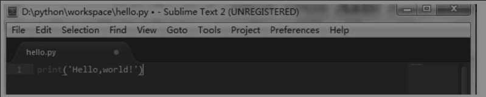
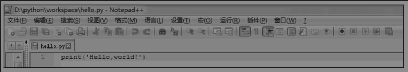
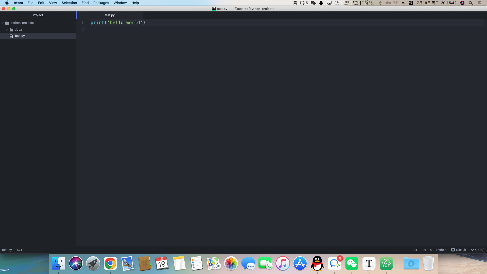
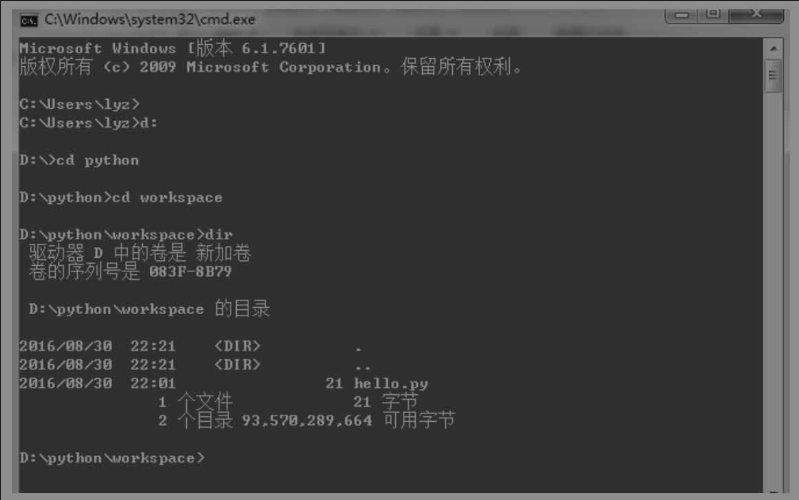
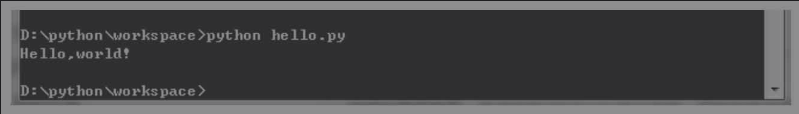
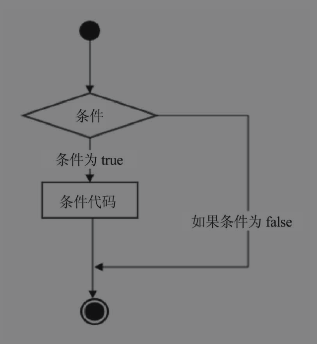
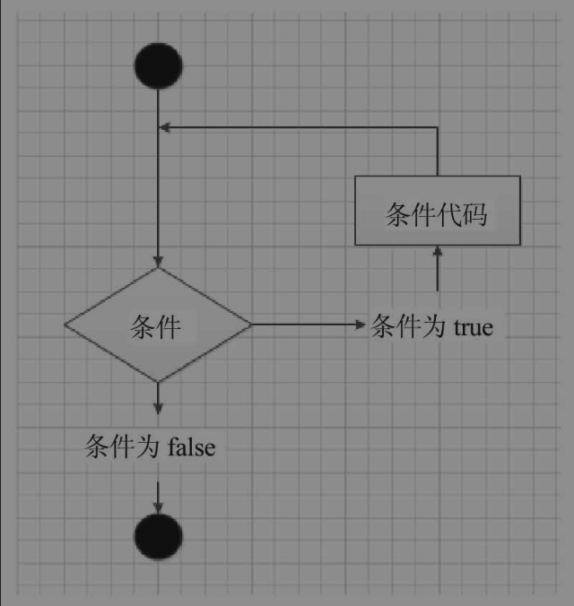
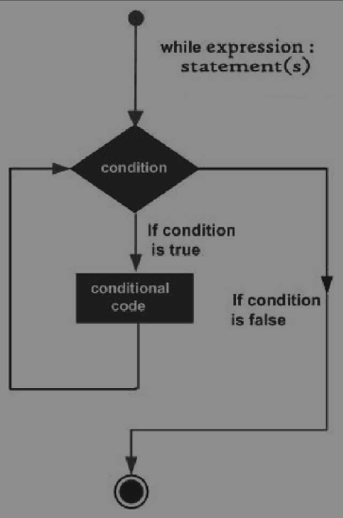

## 第五章：条件、循环和其他语句

本章将会从import语句开始逐步深入介绍条件语句、循环语句以及列表推导式等一些更深层次的语句。


### 1. 使用文本编辑器

到目前为止，我们都是在Python的交互式命令行下操作的，优点是能很快得到操作结果，不过缺点也很明显，就是没法保存操作记录。如果下次还想运行已经编写过的程序，就得重新编写一遍。更重要的一点是，稍微复杂的程序使用交互命令行操作起来就会很复杂。在实际开发时，可以使用文本编辑器编写复杂的代码，写完后可以保存为一个文件，程序也可以反复运行。

这里推荐两款文本编辑器：一款是Sublime Text，可以免费使用，但是不付费会弹出提示框，另一款是Notepad++，也可以免费使用，可根据自己的需要选择中文版和英文版。

**Submlie Text 3：**



**Notepad++：**



以上两个编辑器使用哪一个都可以，老师目前使用的是atom编辑器，后面的示例若没有特殊说明，指的就是在atom编辑器下操作。

**Atom：**




**提示：**绝对不能使用Word和Windows自带的记事本。Word保存的不是纯文本文件，而记事本会自动在文件开始的地方加上几个特殊字符（UTF-8 BOM），从而导致程序运行时出现莫名其妙的错误。


安装好文本编辑器后，打开编辑器，输入以下代码：

```python
print('hello world')
```

**提示：**print前面不要有任何空格。


输入完成后，将文本保存到指定目录（如D:\python\workspace），保存文件名为hello.py（文件的命名随自己的喜好，但一定要以.py结尾）。文件名只能是英文字母、数字和下画线的组合。建议文件名有一定意义，方便记忆和日后查看。

打开命令行窗口（如在Windows中打开cmd命令窗口），把当前目录切换到hello.py所在的目录：



切换到workspace目录下，输入dir命令，查看该文件夹中有哪些文件。当前窗口中该文件夹下有一个名为hello.py的文件。接下来在cmd命令窗口输入python hello.py命令运行hello.py：




在cmd命令窗口中执行Python文件的命令格式为：

```markdown
python 带py后缀的文件名
```

输入命令后按Enter键，即可在cmd命令窗口输出结果，如示例中的 **'hello,world!'**。


如果输入执行的文件不存在就会报错，如在上面的示例中输入python hi.py，cmd命令窗口就会输出如下错误：

```markdown
D:\python\workspace>python hi.py
python: can't open file 'hi.py': [Error 2] No such file or directory
```

该错误信息的意思是，无法打开hi.py文件，没有这个文件或目录。如果在操作中看到类似错误，就需要查看当前目录下是否有这个文件，如用dir命令查看当前文件夹下是否有对应文件。如果文件存放在另一个目录下，就要用cd命令切换到对应目录。


### 2. import 的使用

语言的学习只有在不断深入后才能进一步发现其中隐藏的惊人特性，即使是简单的print函数，在不断使用后也会发现更多使用方式，import将带你进入一个更快捷的编程模式。


##### import 语句

在讲解import语句之前先看一个示例：

```python
import math


r = 5
print('半径为5的圆的面积为: %.2f' % (math.pi * r ** 2))
```

保存文件名为test.py。在cmd命令窗口执行如下命令：

```markdown
(base) Mac-Pro:python_projects poppies$ python test.py
半径为5的圆的面积为: 78.54
```

上面的程序使用了import语句。


import math的意思为从Python标准库中引入math.py模块，这是Python中定义的引入模块的方法。import的标准语法如下：

```python
import module1[, module2[,… moduleN]]
```

表示允许一个import导入多个模块，但各个模块间需要用逗号隔开。

当解释器遇到import语句时，如果模块在当前搜索路径就会被导入。搜索路径是一个解释器，会先搜索所有目录的列表。

当我们使用import语句时，Python解释器怎样找到对应的文件呢？这涉及Python的搜索路径，搜索路径由一系列目录名组成，Python解释器会依次从这些目录中寻找引入的模块。看起来很像环境变量，事实上可以通过定义环境变量的方式确定搜索路径。搜索路径是在Python编译或安装时确定的，被存储在sys模块的path变量中。查看搜索路径的方式如下：

```python
import sys


print('python的搜索路径为: ', sys.path)
```

保存文件名为test.py，在cmd命令窗口执行结果如下：

```markdown
(base) Mac-Pro:python_projects poppies$ python test.py 
python的搜索路径为:  ['/Users/poppies/Desktop/python_projects', '/Users/poppies/miniconda3/lib/python38.zip', '/Users/poppies/miniconda3/lib/python3.8', '/Users/poppies/miniconda3/lib/python3.8/lib-dynload', '/Users/poppies/miniconda3/lib/python3.8/site-packages']
```

由以上输出结果看到，sys.path输出了一个列表，第一项输出的是执行文件所在的目录，即我们执行Python解释器的目录（如果是脚本，就是运行脚本所在的目录）。

了解搜索路径的概念后，可以在脚本中修改sys.path引入一些不在搜索路径中的模块。

上面我们初步引入了import语句，除了用import引入模块外，还有另一种方式引入模块，先看交互模式下输入的示例：

```python
>>> from math import pi
>>> print(pi)
3.141592653589793
>>>
```

上面的操作使用了from math import pi的方式，这是什么意思呢？


在Python中，from语句可以从模块中导入指定部分到当前命名空间中，语法如下：

```python
from modname import name1[, name2[, … nameN]]
```

例如，from math import pi语句就是从math模块中导入pi到当前命名空间，该语句不会将math整个模块导入。比如在math模块中还有sin、exp函数，在这个语句里这两个函数都使用不了，而在导入整个math模块的语句中可以使用。

在交互模式下输入：

```python
>>> import math
>>> print(math.pi)
3.141592653589793
>>> print(math.sin(1))
0.8414709848078965
>>> print(math.exp(1))
2.718281828459045


>>> from math import pi
>>> print(pi)
3.141592653589793
>>> print(sin(1))
Traceback (most recent call last):
  File "<stdin>", line 1, in <module>
NameError: name 'sin' is not defined
>>> 
```

由以上输出结果可知，如果导入模块，就会得到模块中所有对象；如果指定导入某个对象，就只能得到该对象。


这样做的好处是什么呢？先看如下示例：

```python
>>> import math
>>> print(math.pi)
3.141592653589793
>>> print(pi)
Traceback (most recent call last):
  File "<stdin>", line 1, in <module>
NameError: name 'pi' is not defined
>>> 
>>> from math import pi
>>> print(pi)
3.141592653589793
>>> 
```

由上面的输出结果可知，如果在导入math模块时访问pi对象，需要使用math.pi，直接使用pi访问不了，会报错。使用import语句后，可以直接访问pi对象，不需要加上模块名进行访问。


如果要访问模块中多个对象，是否需要一个一个导入呢？如果要访问math中的pi和sin，是否要写两个from math import语句？例如：

```python
from math import pi
from math import sin
```

当然不用，可以直接使用如下语句：

```python
from math import pi, sin
```

可以从一个导入语句导入多个函数，多个函数之间用逗号分割。


如果要访问模块中多个对象，是否需要一个一个导入呢？当然不用，可以直接使用如下语句：

```python
from math import *
```

使用该语句可以将math中所有对象都引入，比如上面几种报错的情况就可以成功输出结果了，例如：

```python
>>> from math import *
>>> print(pi)
3.141592653589793
>>> print(sin(1))
0.8414709848078965
>>> print(exp(1))
2.718281828459045
>>> 
```

由输出结果看到，pi、sin、exp等函数都可以被正确输出了。这是一个简单地将项目中所有模块都导入的方法。在实际开发中，这种声明不建议过多使用，这样不利于编写清晰、简单的代码。只有想从给定模块导入所有功能时才使用这种方式。


除了上述几种方式外，还可以为模块取别名，例如：

```python
>>> import math as m
>>> m.pi
3.141592653589793
>>> 
```

由输出结果看到，给模块取别名的方式为：在导出模块的语句末尾增加一个as子句，as后面跟上别名名称。


既然可以为模块取别名，当然也可以为函数取别名，例如：

```python
>>> from math import pi as p
>>> p
3.141592653589793
>>> 
```

由输出结果可知，我们为pi取了别名为p，为函数取别名的方式和为模块取别名的方式类似，也是在语句后面加上as，as后跟上别名名称。


##### 使用逗号输出

我们在前面的章节已经看到许多使用逗号输出的示例，例如：

```python
>>> student = '小智'
>>> print('学生姓名: ', student)
学生姓名:  小智
>>> 
```

这种方式还可以输出多个表达式，只要将多个表达式用逗号隔开就行，例如：

```python
>>> name = '大家好，我叫小智'
>>> age = '今年18岁'
>>> address = ' 来自长沙...'
>>> print(name, age, address)
大家好，我叫小智 今年18岁  来自长沙...
>>> 
```

由输出结果看到，不使用格式化的方式也可以同时输出文本和变量值。


### 3.  别样的赋值

之前我们介绍了很多赋值语句，在实际使用中，赋值语句还有很多特殊用法，掌握这些用法对于提高编程水平很有帮助。


##### 序列解包

前面已经有不少赋值语句的示例，比如变量和数据结构成员的赋值，不过赋值的方法不止这些，例如：

```python
>>> x, y, z = 1, 2, 3
>>> print(x, y, z)
1 2 3
>>> 
```

由输出结果看到，可以多个赋值操作同时进行。后面再遇到对多个变量赋值时，就不需要对一个变量赋完值再对另一个变量赋值了，用一条语句就可以搞定，例如：

```python
>>> x, y, z = 1, 2, 3
>>> x, y = y, x
>>> print(x, y, z)
2 1 3
```

由输出结果看到，x和y的值交换了，所以可以交换两个或多个变量的值。


在Python中，交换所做的事情叫作序列解包（sequence unpacking）或可选迭代解包，即将多个值的序列解开，然后放到变量序列中。

可以通过下面的示例理解：

```python
>>> nums = 1, 2, 3
>>> nums
(1, 2, 3)
>>> x, y, z = nums
>>> x
1
>>> print(x, y, z)
1 2 3
>>> 
```

由输出结果看到，序列解包后，变量获得了对应的值。

再看另一个示例：

```python
>>> student = {'name': '小萌', 'number': '1001'}
>>> key, value = student.popitem()
>>> key
'number'
>>> value
'1001'
>>> 
```

由输出结果可知，此处作用于元组，使用popitem方法将键-值作为元组返回，返回的元组可以直接赋值到两个变量中。


序列解包允许函数返回一个以上的值并打包成元组，然后通过一个赋值语句进行访问。这里有一点要注意，解包序列中的元素数量必须和放置在赋值符号“=”左边的数量完全一致，否则Python会在赋值时引发异常，例如：

```python
>>> x, y, z = 1, 2, 3
>>> x, y, z
(1, 2, 3)
>>> x, y, z = 1, 2
Traceback (most recent call last):
  File "<stdin>", line 1, in <module>
ValueError: not enough values to unpack (expected 3, got 2)
>>> 
```

由以上输出结果看到，当右边的元素数量和左边的变量数量不一致时，执行结果就会报错。错误原因是没有足够的值解包（左边变量多于右边元素）或多个值未解包（左边变量少于右边元素）。

**注意：**在操作序列解包时，要保证左边和右边的数量相等。


##### 链式赋值

上一小节介绍了可以对序列解包，序列解包在对不同变量赋不同的值时非常有用，赋相同的值时用序列解包也可以实现。其实还可以使用其他方法。

如：链式赋值（Chained Assignment）

示例如下：

```python
>>> x=y=z=10
>>> x
10
>>> 
```

由输出结果可知，可以通过多个等式为多个变量赋同一个值，这种方法叫作链式赋值。

链式赋值是将同一个值赋给多个变量。

上面的语句效果和下面的语句效果一样：

```python
>>> x = 10
>>> y = x
>>> y
10
>>> 
```

由输出结果可知，既可以使用链式方式赋值，又可以单独赋值，显然链式方法更简洁。


##### 增量赋值

我们在之前讲解了赋值运算符。使用赋值运算符时没有将表达式写成类似x=x+1的形式，而是将表达式放置在赋值运算符（=）的左边（如将x=x+1写成x+=1），这种写法在Python中叫作增量赋值（Augemented Assignment）。这种写法对*（乘）、/（除）、%（取模）等标准运算符都适用，例如：

```python
>>> x = 5
>>> x += 1
>>> x
6
>>> x -= 2
>>> x
4
>>> x *= 2
>>> x
8
>>> x /= 4
>>> x
2.0
>>>
```

由操作结果可以看到，使用增量赋值相对于赋值操作看上去更简洁。


增量赋值除了适用于数值类型外，还适用于二元运算符的数据类型，例如：

```python
>>> field = 'hello,'
>>> field += 'world'
>>> field
'hello,world'
>>> field *= 2
>>> field
'hello,worldhello,world'
>>> 
```

由操作结果可知，增量赋值操作也可以用于字符串。

增量赋值可以让代码在很多情况下更易读，也可以帮助我们写出更紧凑、简练的代码。


### 4. 语句块

语句块并非一种语句，语句块是一组满足一定条件时执行一次或多次的语句。

语句块的创建方式是在代码前放置空格缩进。同一段语句块中每行语句都要保持同样的缩进，如果缩进不同，Python编译器就会认为不属于同一个语句块或认为是错误的。

在Python中，冒号（:）用来标识语句块的开始，语句块中每一个语句都需要缩进（缩进量相同）。当退回到和已经闭合的块一样的缩进量时，表示当前语句块已经结束了。


### 5. 条件语句

到目前为止，我们编写的程序都是简单地按语句顺序一条一条执行的。本小节将介绍让程序选择执行语句的方法。


##### 布尔变量的作用

布尔变量我们在之前的内容中已经有所接触，之前内容的运算符中多处提到的True、False就是布尔变量，布尔变量一般对应的是布尔值。

下面的值 (关键字) 在作为布尔表达式时，会被解释器看作假（False）：

```python
False 
None 
0 
"" 
() 
[] 
{}
```

换句话说，标准值False和None、所有类型的数字0（包括浮点型、长整型和其他类型）、空序列（如空字符串、空元组和空列表）以及空字典都为假。其他值都为真，包括原生的布尔值True。


Python中所有值都能被解释为真值，这可能会让你不太明白，但理解这点非常有用。在Python中，标准的真值有True和False两个。在其他语言中，标准的真值为0（表示假）和1（表示真）。事实上，True和False只不过是1和0的另一种表现形式，作用相同，例如：

```python
>>> True
True
>>> False
False
>>> True == 1
True
>>> False == 0
True
>>> True + False + 2
3
>>> 
```

由上面的输出结果看到，在Python中，True和1等价，False和0等价。


布尔值True和False属于布尔类型，bool函数可以用来转换其他值，例如：

```python
>>> bool('good good study')
True
>>> bool('')
False
>>> bool(3)
True
>>> bool(0)
False
>>> bool([1])
True
>>> bool([])
False
>>> bool()
False
>>>
```

由输出结果看到，可以用bool函数做boolean值转换。

因为所有值都可以用作布尔值（真值），所以几乎不需要对它们进行显式转换，Python会自动转换这些值。

**提示：**尽管[]和""都为假，即bool([])==bool("")==False，不过它们本身不相等，即[]!=""。其他不同类型的假值也是如此，如()!=False。


##### if 语句

真值可以联合使用，首先看如下代码：

```python
In [1]: # if 基本用法
In [2]: greeting = 'hello'
In [3]: if greeting == 'hello':
   ...:     print('hello')
   ...: 
hello
In [4]: 
```

该示例为if条件执行语句的一个实现示例。如果条件（在if和冒号之间的表达式）判定为真，后面的语句块（本例中是print语句）就会被执行；如果条件判定为假，语句块就不会被执行。上述示例代码的执行过程如下图所示。




上图中的小黑点为if语句的起点，往后执行到条件语句（条件语句如greeting=='hello'），如果条件为真，就执行条件代码，然后结束这个if条件语句；如果条件为假，就跳过这段条件代码，这个if条件语句直接结束。


在 if 语句块中还可以执行一些复杂的操作，例如：

```python
In [1]: greeting = 'hello'

In [2]: if greeting == 'hello':
   ...:     student = {'小萌': '1001', '小智': '1002'}
   ...:     print(f'字典元素个数为: {len(student)}')
   ...:     student.clear()
   ...:     print(f'字典删除后元素个数为: {len(student)}')
   ...: 
字典元素个数为: 2
字典删除后元素个数为: 0

In [3]: 
```

此处的if语句块由多条语句组成，编写过程中要注意保持语句的缩进一致，否则在执行时会报错。if语句的条件判定除了使用==外，还可以使用>（大于）、<（小于）、>=（大于等于）、<=（小于等于）等条件符表示大小关系。除此之外，还可以使用各个函数或方法返回值作为条件判定。使用条件符的操作和使用==一样，使用函数或表达式的操作在后续课程中会逐步介绍。


##### else 子句

在if语句的示例中，当greeting的值为hello时，if后面的条件执行结果为true，进入下面的语句块中执行相关语句。如果greeting的值不是hello，就不能进入语句块，如果想显示相关提示，比如告诉我们greeting的值不为hello或执行的不是if中的语句块，该怎么办呢？例如：

```python
In [1]: greeting = 'hi'

In [2]: if greeting == 'hello':
   ...:     print('hello')
   ...: else:
   ...:     print('该语句块不在if中，greeting的值不是hello')
   ...: 
该语句块不在if中，greeting的值不是hello

In [3]: 
```

这段程序加入了一个新条件子句 —— else子句。之所以叫子句，是因为else不是独立语句，只能作为if语句的一部分。使用else子句可以增加一种选择。

由输出结果看到，if语句块没有被执行，执行的是else子句中的语句块。同if语句一样，else子句中的语句块也可以编写复杂语句。


##### elif 子句

在else子句的示例中，如果除if条件外，还有多个子条件需要判定，该怎么办呢？Python为我们提供了一个elif语句，elif是else if的简写，意思为具有条件的else子句，例如：

```python
In [1]: num = 10

In [2]: if num > 10:
   ...:     print('num的值大于10')
   ...: elif 0 <= num <= 10:
   ...:     print('num的值介于0和10之间')
   ...: else:
   ...:     print('num的值小于0')
   ...: 
num的值介于0和10之间

In [3]: 
```

由以上程序可知，elif需要和if、else子句联合使用，不能独立使用，并且必须以if语句开头，可以选择是否以else子句结尾。


##### 嵌套代码块

我们前面讲述了if语句、else子句和elif子句，这几个语句可以进行条件的选择判定，不过我们在实际项目开发中经常需要一些更复杂的操作。

例如：

```python
In [1]: num = 10

In [2]: if num % 2 == 0:
   ...:     if num % 3 == 0:
   ...:         print('你输入的数字可以整除 2 和 3')
   ...:     elif num % 4 == 0:
   ...:         print('你输入的数字可以整除 2 和 4')
   ...:     else:
   ...:         print('你输入的数字可以整除 2，但不能整除 3 和 4')
   ...: else:
   ...:     if num % 3 == 0:
   ...:         print('你输入的数字可以整除 3，但不能整除 2')
   ...:     else:
   ...:         print('你输入的数字不能整除2 和 3')
   ...: 
你输入的数字可以整除 2，但不能整除 3 和 4

In [3]: 
```

由上面的程序可知，在if语句的语句块中还存在if语句、语句块以及else子句，else子句的语句块中也存在if语句和else子句。

在Python中，该示例使用的这种结构的代码称作嵌套代码。所谓嵌套代码，是指把if、else、elif等条件语句再放入if、else、elif条件语句块中，作为深层次的条件判定语句。


### 6. 更多操作


##### 同一性运算符

is运算符比较有趣。我们先看如下程序：

```python
In [1]: x = y = [1, 2, 3]

In [2]: z = [1, 2, 3]

In [3]: x == y
Out[3]: True

In [4]: x == z
Out[4]: True

In [5]: x is y
Out[5]: True

In [6]: x is z
Out[6]: False
```

在最后一个输出语句之前，一切看起来非常美好，都在意料中，不过最后一个语句却出现了问题，为什么x和z相等却不相同呢？

这是因为is运算符用于判定同一性而不是相等性。变量x和y被绑定在同一个列表上，而变量z被绑定在另一个具有相同数值和顺序的列表上。它们的值可能相等，却不是同一个对象。

也可以从内存的角度思考，即它们所指向的内存空间不一样，x和y指向同一块内存空间，z指向另一块内存空间。

是不是看起来有些不可理喻，再看如下示例：

```python
>>> x = [1, 2, 3]
>>> y = [1, 5]
>>> x is not y
True
>>> del x[2]
>>> x
[1, 2]
>>> y[1] = 2
>>> y
[1, 2]
>>> x == y
True
>>> x is y
False
>>> 
```

在上面的程序中，列表x和y一开始是不同的列表，后面将列表值更改为相等，但还是两个不同的列表，即两个列表值相等却不等同。

综上所述，使用==运算符判定两个对象是否相等，使用is判定两个对象是否等同（是否为同一对象）。


**提示：**尽量避免用is运算符比较数值和字符串这类不可变值。由于Python内部操作这些对象方式的原因，使用is运算符的结果是不可预测的，除非你对堆栈有一定熟悉程度，否则很难预测运算结果。


##### 比较字符串和序列

字符串可以按照字母排列顺序进行比较，我们在前面的内容中已经介绍过。这里介绍其他序列的比较操作。

其他序列比较的不是字符而是元素的其他类型，例如：

```python
>>> [1, 2] < [2, 1]
True
>>> [1, 2] < [1, 2]
False
>>> [1, 2] == [1, 2]
True
>>> 
```

由操作结果可知，也可以对列表进行比较操作。


如果一个序列中包括其他序列元素，比较规则也适用于序列元素，例如：

```python
>>> [2, [1, 2]] < [2, [1, 3]]
True
>>> 
```

由操作结果看到，也可以对嵌套列表进行比较操作。


##### 布尔运算符

前面我们已经讲述过不少布尔运算的操作。不过有时要检查一个以上的条件，如果按照前面的操作方式，就会多走一些弯路。

例如：

```python
In [1]: num = 10

In [2]: if num <= 10:
   ...:     if num >= 5:
   ...:         print('num的值介于5和10之间')
   ...:     else:
   ...:         print('num的值不介于5和10之间')
   ...: else:
   ...:     print('num的值不介于5和10之间')
   ...: 
num的值介于5和10之间

In [3]: 
```

上面的程序在写法上没什么问题，但是走了一些不必要的弯路，可以将代码编写得更简洁：

```pyrthon
In [1]: if num <= 10 and num >= 5:
   ...:     print('num的值介于5和10之间')
   ...: else:
   ...:     print('num的值不介于5和10之间')
```

或者：

```python
In [2]: num = 10

In [3]: if 5 <= num <= 10:
   ...:     print('num的值介于5和10之间')
   ...: else:
   ...:     print('num的值不介于5和10之间')
```

上面的程序明显更加简洁、易读。


and运算符用于连接两个布尔值，并在两者都为真时返回真，否则返回假。与and同类的还有or和not两个运算符。

布尔运算符有一个有趣的特性：只有在需要求值时才求值。举例来说，表达式x and y需要两个变量都为真时才为真，所以如果x为假，表达式就立刻返回false，无论y的值是多少。实际上，如果x为假，表达式就会返回x的值，否则返回y的值。这种行为被称为短路逻辑（short-circuit logic）或惰性求值（lazy evaluation）。布尔运算符通常被称为逻辑运算符，这种行为同样适用于or。在表达式x or y中，x为真时直接返回x的值，否则返回y的值。注意，这意味着在布尔运算符后面的代码都不会被执行。

例如：

```python
In [1]: # 0 为false 1为true
In [2]: 0 and 2
Out[2]: 0
In [3]: 1 and 2
Out[3]: 2
  
In [5]: 1 or 2
Out[5]: 1
In [6]: 0 or 2
Out[6]: 2
```


##### 断言

在Python中，有一个和if语句工作方式非常相近的关键字，其工作方式类似如下伪代码：

```python
if not condition:
    crash program
```

在Python中为什么需要这样的代码呢？

在没完善一个程序之前，我们不知道程序会在哪里出错，与其在运行时崩溃，不如在出现错误条件时就崩溃。一般来说，可以要求一些条件必须为真。在Python中，assert关键字就能实现这种工作方式。

先来看一个示例：

```python
>>> x = 3
>>> assert x > 0, 'x is not zero or negative'
>>> assert x % 2 == 0, 'x is not an even number'  # 提示x不是偶数
Traceback (most recent call last):
  File "<stdin>", line 1, in <module>
AssertionError: x is not an even number
>>> 
```

由上面的输出结果看到，当assert后面的条件为真时，程序正常运行；当assert后面的条件为假时，输出错误信息。错误的提示信息由我们自己定义，这个错误提示信息可以称为异常参数。assert的异常参数是在断言表达式后添加的字符串信息，用来解释断言并更容易知道问题出在哪里。


使用assert断言是学习Python的好习惯，Python assert断言语句的格式及用法很简单。

使用assert断言时，要注意以下几点：

1. assert断言用来声明某个条件是真的。
2. 如果你非常确信使用的列表中至少有一个元素，想要检验这一点，并在它非真时引发一个错误，那么assert语句是应用在这种情形下的理想语句。
3. assert语句失败时，会引发一个AssertionError。


### 7. 循环

程序在一般情况下是按顺序执行的。编程语言提供了各种控制结构，允许更复杂的执行路径。循环语句允许我们多次执行一个语句或语句组。下图所示为大多数编程语言中循环语句的执行流程。



我们已经知道条件为真（或假）时程序如何执行了。若想让程序重复执行，该怎么办呢？比如输出1～100所有数字，是写100个输出语句吗？显然你不想这样做。接下来我们学习如何解决这个问题。


##### while 循环

我们先看如何使用简单的程序输出1～100所有数字，程序如下：

```python
n = 1
while n <= 100:
    print(f'当前数字是：{n}')
    n += 1
```

由输入程序看到，只需短短几行就可以实现这个功能，我们看输出结果（由于全部输出会太长，也没有必要，因此此处显示几行输出结果作为展示）：

```markdown
当前数字是：1
当前数字是：2
当前数字是：3
当前数字是：4
...
```

由输出结果看到，按顺序输出了对应结果。

该示例中使用了while关键字。在Python编程中，while语句用于循环执行程序，以处理需要重复处理的任务。基本语法形式为：

```markdown
while 判断条件:
    执行语句...
```

执行语句可以是单个语句或语句块。判断条件可以是任何表达式，所有非零、非空（null）的值都为真（true）。当判断条件为假（false）时，循环结束。


while循环的执行流程如下图所示：



该流程图的意思为：首先对while条件判定，当条件为true时，执行条件语句块，执行完语句块再判定while条件，若仍然为true，则继续执行语句块，直到条件为false时结束循环。


##### for 循环

我们在上一小节讲述了while循环，可以看到while语句非常灵活，例如：

```python
n = 0
fields = ['a', 'b', 'c']
while n < len(fields):
    print(f'当前字母是：{fields[n]}')
    n += 1
```

该代码实现的功能是将列表中的元素分别输出。该程序的实现没有什么问题，我们是否有更好的方式实现这个功能呢？答案是有，例如：

```python
fields = ['a', 'b', 'c']
for f in fields:
    print(f'当前字母是：{f}')
```

可以看到，代码比前面使用while循环时更简洁，代码量也更少。程序执行的输出结果如下：

```markdown
当前字母是：a
当前字母是：b
当前字母是：c
```

该示例使用了for关键字。在Python中，for关键字叫作for循环，for循环可以遍历任何序列的项目，如一个列表或字符串。

for循环的语法格式如下：

```python
for iterating_var in sequence:
    statements(s)
```

sequence是任意序列，iterating_var是序列中需要遍历的元素，statements是待执行的语句块。

for循环的执行流程下图所示：


该流程图的意思为：首先对for条件判定，游标（后面会详细讲解这个词）指向第0个位置，即指向第一个元素，看sequence序列中是否有元素，若有，则将元素值赋给iterating_var，接着执行语句块，若语句块中需要获取元素值，则使用iterating_var的值，执行完语句块后，将序列的游标往后挪一个位置，再判定该位置是否有元素，若仍然有元素，则继续执行语句块，然后序列的游标再往后挪一个位置，直到下一个位置没有元素时结束循环。


我们再看以下示例：

```python
print('-----for 循环字符串-----')
for letter in 'good':
    print(f'当前字母: {letter}')
    
print('-----for 循环列表-----')
numbers = [1, 2, 3]
for num in numbsers:
    print(f'当前数字: {num}')
    
print('-----for 循环字典-----')
tups = {'name': '小智', 'number': '1002'}
for tup in tups:
    print(f'{tup}: {tups[tup]}')
```

输出结果如下：

```markdown
-----for 循环字符串-----
当前字母：g
当前字母：o
当前字母：o
当前字母：d
-----for 循环列表-----
当前数字：1
当前数字：2
当前数字：3
-----for 循环字典-----
number: 1002
name: 小智
```

由上面的输入代码和输出结果可以看到，for循环的使用还是比较方便的。

**提示：**如果能使用for循环，就尽量不要使用while循环。


##### 循环遍历字典元素

在上一小节的示例中我们已经提供了使用for循环遍历字典的代码，代码如下：

```python
tups = {'name': '小智', 'number': '1002'}
for tup in tups:
    print(f'{tup}: {tups[tup]}')
```

可以看到，此处用for循环对字典的处理看起来有一些繁杂，是否可以使用更直观的方式处理字典呢？

还记得我们前面学习的序列解包吗？for循环的一大好处是可以在循环中使用序列解包，例如：

```python
tups = {'name': '小智', 'number': '1002'}
for key, value in tups.items():
    print(f'{key}: {value}')
```

输出结果如下：

```markdown
number: 1002
name: 小智
```

由输入代码和输出结果看到，可以使用items方法将键-值对作为元组返回。

**提示：**字典中的元素是没有顺序的。也就是说，迭代时字典中的键和值都能保证被处理，但是处理顺序不确定。这也是用for循环输出字典中的元素时不按照顺序输出的原因。


##### 迭代工具

在Python中，迭代序列或其他可迭代对象时，有一些函数非常有用。下面我们介绍一些有用的函数。


- 并行迭代

  程序可以同时迭代两个序列，输入如下：

  ```python
  student = ['xiaomeng', 'xiaozhi', 'xiaoqiang']
  number = [1001, 1002, 1003]
  for i in range(len(student)):
      print(f'{student[i]的学号是: {number[i]}}')
  ```

  程序执行结果如下：

  ```markdown
  xiaomeng的学号是：1001
  xiaozhi的学号是：1002
  xiaoqiang的学号是：1003
  ```

  在程序中，i是循环索引的标准变量名。

  

  在Python中，内建的zip函数用来进行并行迭代，可以把两个序列合并在一起，返回一个元组的列表，例如：

  ```python
  student = ['xiaomeng', 'xiaozhi', 'xiaoqiang']
  number = [1001, 1002, 1003]
  for name, num in zip(student, number):
      print(f'{name}的学号是：{num}')
  ```

  程序执行结果和前面一样。

  

  zip函数可以作用于任意数量的序列，并且可以应付不等长的序列，当短序列“用完”时就会停止，例如：

  ```python
  for num_1, num_2 in zip(range(3), range(100)):
      print(f'zip键值对为：{num_1} {num_2}')
  ```

  程序执行结果如下：

  ```markdown
  zip键值对为：0 0
  zip键值对为：1 1
  zip键值对为：2 2
  ```

  由输出结果看到，zip函数以短序列为准，当短序列遍历结束时，for循环就会遍历结束。

  **提示：**此处用到的range函数是Python 3中的函数，在Python 2版本中存在与这个函数功能类似的xrange函数。

  

- 翻转和排序迭代

  我们在列表中学习过reverse和sort方法，此处介绍两个类似的函数——reversed和sorted函数。这两个函数可作用于任何序列或可迭代对象，但不是原地修改对象，而是返回翻转或排序后的版本。在交互模式下输入：

  ```python
  >>> sorted([5, 3, 7, 1])
  [1, 3, 5, 7]
  >>> sorted('hello, world')
  [' ', ',', 'd', 'e', 'h', 'l', 'l', 'l', 'o', 'o', 'r', 'w']
  >>> reversed('hello, world')
  <reversed object at 0x1016c2fa0>
  >>> list(reversed('hello, world'))
  ['d', 'l', 'r', 'o', 'w', ' ', ',', 'o', 'l', 'l', 'e', 'h']
  >>> ''.join(reversed('hello, world'))
  'dlrow ,olleh'
  >>> 
  ```

  由输出结果我们看到，sorted函数返回的是一个列表，reversed函数返回的是一个可迭代对象。它们的具体含义不用过多关注，在for循环和join方法中使用不会有任何问题。如果要对这两个函数使用索引、分片及调用list方法，就可以使用list类型转换返回对象。


##### 跳出循环

我们在前面的示例中讲过，循环会一直执行，直到条件为假或序列元素用完时才会结束。若我们想提前中断循环，比如循环的结果已经是我们想要的了，不想让循环继续执行而占用资源，有什么方法可以实现呢？

Python提供了break、continue等语句可用于这种情形。


- break

  break语句用来终止循环语句，即使循环条件中没有False条件或序列还没有遍历完，也会停止执行循环语句。	

  break语句用在while和for循环中。

  如果使用嵌套循环，break语句就会停止执行最深层的循环，并开始执行下一行代码。

  break语句语法如下：

  ```python
  numbers = [1, 2, 3]
  for i in numbers:
      print(i)
      break
  ```

  当遇到break语句时，无论执行什么条件，都跳出这个循环，例如：

  ```python
  # 示例一
  for letter in 'hello':
      if letter == 'l':
          break
      print(f'当前字母为: {letter}')
      
      
  # 示例二
  num = 10
  while num > 0:
      print(f'输出的数字为: {num}')
      num -= 1
      if num == 8:
          break
  ```

  输出结果如下：

  ```markdown
  当前字母为: h
  当前字母为: e
  输出的数字为: 10
  输出的数字为: 9
  ```

  由输出结果看到，在示例1中，输出语句输出循环遍历到的字符，当遇到指定字符时，跳出for循环。在示例2中，使用while做条件判定，在语句块中输出满足条件的数字，当数字等于8时，跳出while循环，不再继续遍历。

  

- continue

  continue语句用来告诉Python跳过当前循环的剩余语句，然后继续进行下一轮循环。

  continue语句用在while和for循环中。

  continue语句的语法格式如下：

  ```python
  numbers = [1, 2, 3]
  for i in numbers:
      print(i)
      continue
  ```

  当执行过程中遇到continue语句时，无论执行条件是真还是假，都跳过这次循环，进入下一次循环，例如：

  ```python
  for letter in 'hello':
      if letter == 'l':
          continue
      print(f'当前字母为: {letter}')
      
      
  # 示例二
  num = 3
  while num > 0:
      print(f'输出的数字为: {num}')
      num -= 2
      if num == 8:
          continue
  ```

  输出结果如下：

  ```markdown
  当前字母为: h
  当前字母为: e
  当前字母为: o
  输出的数字为: 3
  输出的数字为: 1
  ```

  由输出结果看到，相比于break语句，使用continue语句只是跳过一次循环，不会跳出整个循环。


##### 循环中的 else 子句

- 在for循环中使用else语句
  
  在while条件语句为false时，执行else的语句块，例如：
  
  ```python
  num = 0
  while num < 3:
      print(f'{num}小于3')
      num += 1
  else:
      print(f'{num}大于或等于3')
  print('结束循环')
  ```
  
  执行结果如下：
  
  ```markdown
  0小于3
  1小于3
  2小于3
  3大于或等于3
  结束循环
  ```
  
  由输出结果看到，while循环结束后执行了else语句中的语句块，输出“3大于或等于3”语句。


- 在for循环中使用else语句

  在for条件语句为false或结束后没有被break中断时，执行else的语句块，例如：

  ```python
  names = ['xiaomeng', 'xiaozhi']
  for name in names:
      if name == 'xiao':
          print(f'名称: {name}')
          break
      print(f'循环名称列表: {name}')
  else:
      print('没有循环数据')
  print('结束循环')
  ```

  程序结果执行如下：

  ```python
  循环名称列表: xiaomeng
  循环名称列表: xiaozhi
  没有循环数据
  结束循环
  ```

  由输出条件看到，for循环结束后执行了else语句块中的内容。


### 8. pass 语句

Python中的pass是空语句，作用是保持程序结构的完整性。pass语句的语法格式如下：

```python
for i in range(100):
    pass
```

pass不做任何事情，只是占位语句。


为什么使用一个什么都不做的语句呢？再来看如下代码：

```python
name = 'xiaomeng'
if name == 'xiaomeng':
    print('hello')
elif name == 'xiaozhi':
    # 预留，先不做任何处理
else:
    print('nothing')
```

执行程序，结果如下：

```markdown
else:
    ^
IndentationError: expected an indented block
```

执行报错了，因为程序中有空代码，在Python中空代码是非法的。解决办法是在语句块中加一个pass语句。上面的代码更改为：

```python
name = 'xiaomeng'
if name == 'xiaomeng':
    print('hello')
elif name == 'xiaozhi':
    pass
    # 预留，先不做任何处理
else:
    print('nothing')
```

执行结果如下：

```python
hello
```


### 9. 作业练习 - 猜数字游戏

为巩固本章的学习内容，设计一个小游戏帮助我们系统地温习本章的知识点。

游戏内容是这样的：

随便给定一个在一定范围内的数字，让用户去猜这个数字是多少，并输入自己猜测的数字，系统判断是否为给定数字。如果输入的猜测数字大于给定值，提示你输入的值大了；如果输入的值小于给定值，就提示输入的值小了；如果等于给定值，就提示你猜对了，并展示总共猜了多少次。


在看参考代码之前先思考一下，要实现这个小游戏，你会怎么做呢？

先从最简单的方向思考，有3种情况：

1. 输入值小于给定值。
2. 输入值等于给定值。
3. 输入值大于给定值。


对于情况 1 和 3 ，需要继续输入；对于情况2，输入结束。需要提供3个变量：一个变量用于记录给定值，一个变量用于记录输入值，还有一个变量用于记录输入了多少次，注意输入次数至少是一次。


```python
import random


number = random.randint(1, 100)
guess = 0
while True:
    # Python input() 方法为输入函数 返回值的类型为字符串
    num_input = input('请输入一个1到100的数字: ')
    guess += 1
    # Python isdigit() 方法检测字符串是否只由数字组成，只对 0 和 正数有效。
    if not num_input.isdigit():
        print('请输入数字...')
    elif int(num_input) < 0 or int(num_input) >= 100:
        print('输入的数字必须介于1到100...')
    else:
        if number == int(num_input):
            print(f'恭喜您，您猜对了，您总共猜了{guess}次')
            break
        elif number > int(num_input):
            print('您输入的数字小了...')
        elif number < int(num_input):
            print('您输入的数字大了...')
        else:
            print('系统发生不可预测的问题，请联系管理人员进行处理...')
```

