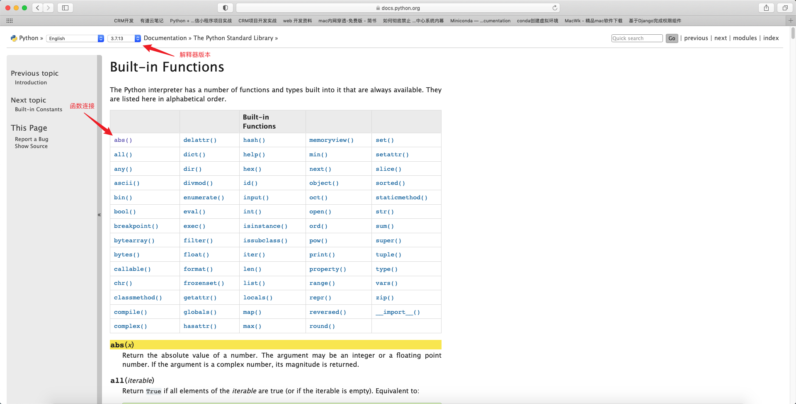

## 第六章：函数

函数是组织好的、可重复使用的、用来实现单一或相关联功能的代码段。

函数能够提高应用的模块性和代码的重复利用率。

Python提供了许多内建函数，如print()、int()。同学们也可以自己创建函数，这样的函数称为用户自定义函数。


### 1. 调用函数

在程序设计中，函数是指用于进行某种计算的一系列语句的有名称的组合。

定义函数时，需要指定函数的名称并编写一系列程序语句，之后可以使用名称“调用”这个函数。


前面我们已经介绍过函数调用，例如：

```python
>>> print('hello world')
hello world
>>> type('hello')
<class 'str'>
>>> int(12.1)
12
```

以上代码就是函数的调用。函数括号中的表达式称为函数的参数。函数“接收”参数，并“返回”结果，这个结果称为返回值（return value）。

比如上面示例中的int(12.1)，12.1就是“接收”的参数，得到的结果是12，12就是返回值。


Python 3内置了很多有用的函数，可以直接调用。要调用一个函数，就需要知道函数的名称和参数，比如求绝对值的函数abs只有一个参数。可以直接从Python的官方网站查看文档：https://docs.python.org/3.7/library/functions.html

进入官方网站可以看到如下图所示的页面，这里显示了Python 3内置的所有函数，abs()函数在第一个。从左上角可以看到这个函数是Python 3.7版本的内置函数。




单击abs()函数，页面会跳转到下图所示的位置，有对abs()函数的说明。截图中的意思是：返回一个数的绝对值。参数可能是整数或浮点数。如果参数是一个复数，就返回它的大小。


除了到Python官方网站查看文档外，还可以在交互式命令行通过help(abs)查看abs函数的帮助信息。在交互模式下输入：

```python
>>> help(abs)
Help on built-in function abs in module builtins:
abs(x, /)
    Return the absolute value of the argument.
```

可以看到，输出了对应的帮助信息，但是没有官方网站的详细。


下面实际操作abs()函数，在交互模式下输入：

```python
>>> abs(20)
20
>>> abs(-20)
20
>>> abs(3.14)
3.14
>>> abs(-3.14)
3.14
>>> 
```

从上面的输出结果可以看出，abs函数用于求绝对值。


调用abs()函数时，如果传入的参数数量不对，就会报TypeError的错误，Python会明确告诉你：abs()有且只有一个参数，但给出了两个，例如：

```python
>>> abs(5, 6)
Traceback (most recent call last):
  File "<stdin>", line 1, in <module>
TypeError: abs() takes exactly one argument (2 given)
>>> 
```

如果传入的参数数量是对的，但参数类型不能被函数接收，也会报TypeError的错误。给出错误信息：str是错误的参数类型，例如：

```python
>>> abs('hello')
Traceback (most recent call last):
  File "<stdin>", line 1, in <module>
TypeError: bad operand type for abs(): 'str'
>>> 
```


函数名其实是指向一个函数对象的引用，完全可以把函数名赋给一个变量，相当于给这个函数起了一个“别名”，在交互模式下输入：

```python
>>> fun = abs  # 变量fun指向abs函数
>>> fun(-5)
5
>>> fun(3.14)
3.14
>>> fun(-3.14)
3.14
>>> 
```

调用Python中的函数时，需要根据函数定义传入正确的参数。如果函数调用出错，就要会看错误信息，这时就要考验你的英语水平了。


### 2. 定义函数

到目前为止，我们用的都是Python内置函数。这些Python内置函数的定义部分对我们来说是透明的。因此，我们只需关注这些函数的用法，而不必关心函数是如何定义的。

Python支持自定义函数，即由我们自己定义一个实现某个功能的函数。下面是自定义函数的简单规则。

1. 函数代码块以def关键词开头，后接函数标识符名称和圆括号“()”。
2. 所有传入的参数和自变量都必须放在圆括号中，可以在圆括号中定义参数。
3. 函数的第一行语句可以选择性使用文档字符串，用于存放函数说明。
4. 函数内容以冒号开始，并且要缩进。
5. return［表达式］结束函数，选择性返回一个值给调用方。不带表达式的return相当于返回None。


Python定义函数使用def关键字，一般格式如下：

```python
def 函数名(参数):
    函数体
```

或者更直观地表示为：

```python
def <name>(arg1, arg2, ..., argN):
    <statements>
```

函数的名字必须以字母开头，可以包括下画线“_”。

和定义变量一样，不能把Python的关键字定义成函数的名字。

函数内的语句数量是任意的，每个语句至少有一个空格的缩进，以表示该语句属于这个函数。函数体必须保持缩进一致，因为在函数中，缩进结束就表示函数结束。


现在已经知道定义函数的简单规则和一般格式了。下面我们进行实际操作，在文本中定义函数并调用（func_define.py）：

```python
def hello():
    print('hello world')
    
hello()	
```

以上示例中的hello()就是我们自定义的函数。此处为了看到执行结果，在函数定义完后做了函数的自我调用。如果不自我调用，执行该函数就没有任何输出，当然也不会报错（除非代码有问题）。


在cmd命令下执行以上.py文件，执行结果如下：

```markdown
hello world
```

需要注意以下几点：

1. 没有return语句时，函数执行完毕也会返回结果，不过结果为None。
2. return None可以简写为return。
3. 在Python中定义函数时，需要保持函数体中同一层级的代码缩进一致。


根据以上示例，是不是一个函数中只能有一条语句呢？除了输出操作，还能执行其他操作吗？

在一个函数中可以输出多条语句，并能做相应的运算操作，以及输出运算结果。例如，定义输出多条语句的函数并执行（print_more.py）：

```python
def print_more():
    print('该函数可以输出多条语句，我是第一条')
    print('我是第二条')
    print('我是第三条')
    
print_more()
```

执行结果如下：

```markdown
该函数可以输出多条语句，我是第一条
我是第二条
我是第三条
```


定义输出数字和计算的函数并执行（mix_operation.py）：

```python
def mix_operation():
    a = 10
    b = 20
    print(a)
    print(b)
    print(a + b)
    print(f'a + b 的和等于: {a + b}')
    
mix_operation()
```

执行结果如下：

```markdown
10
20
30
a + b 的和等于: 30
```

以上示例验证了前面的内容。


定义一个什么都不做的函数可以吗？当然可以。如果想定义一个什么都不做的空函数，可以用pass语句，定义如下函数并执行（do_nothing.py）：

```python
def do_nothing():
    pass
  
do_nothing()
```

执行结果为没有任何输出。

pass语句什么都不做，有什么用呢？实际上pass可以作为占位符，比如现在还没想好怎么写函数的代码，可以先放一个pass，让代码能运行起来。

函数的目的是把一些复杂操作隐藏起来，用于简化程序的结构，使程序更容易阅读。函数在调用前必须先定义。


### 3. 函数的参数

我们在上一节中讲述了如何定义函数，不过只讲述了定义简单函数，还有一类函数是带参数的，称为带参数的函数。本节将探讨如何定义带参数的函数及其使用。

调用函数时可以使用以下参数类型：

1. 必须参数。
2. 关键字参数。
3. 默认参数。
4. 可变参数。
5. 组合参数。


##### 必须参数

必须参数必须以正确的顺序传入函数。调用时数量必须和声明时一样。比如需要传入a、b两个参数，就必须以a、b的顺序传入，不能以b、a传入，即使不报错，也会导致结果的错误。

定义如下函数并执行（param_one.py）：

```python
def param_one(val_str):
    print(f'zhe param is: {val_str}')
    print(f'我是一个传入参数，我的值是: {val_str}')


param_one('hello, world')
```

执行结果如下：

```markdown
zhe param is: hello, world
我是一个传入参数，我的值是: hello, world
```

我们定义了一个必须传入一个参数的函数param_one(val_str)，传入的参数为val_str，结果是将“hello,world”传给val_str。


对于上例，若不传入参数或传入一个以上的参数，结果会怎样呢？例如：

```python
param_one()  # 没有传入参数
```

执行结果如下：

```markdown
Traceback (most recent call last):
  File "/Users/poppies/Desktop/python_projects/基础部分/param_one.py", line 6, in <module>
    param_one()
TypeError: param_one() missing 1 required positional argument: 'val_str'
```

执行结果告诉我们，函数缺少一个必需的定位参数，参数类型为val_str。

```python
param_one('hello', 'world')  # 传入一个以上的参数
```

执行结果如下：

```markdown
Traceback (most recent call last):
  File "/Users/poppies/Desktop/python_projects/基础部分/param_one.py", line 6, in <module>
    param_one('hello', 'world')
TypeError: param_one() takes 1 positional argument but 2 were given
```

执行结果告诉我们，函数只需一个位置参数却给了两个。

通过示例可以看到，对于定义的param_one()函数，不传入参数或传入一个以上参数，都会报错。所以对于此类函数，必须传递对应正确个数的参数。


##### 关键字参数

关键字参数和函数调用关系紧密，函数调用使用关键字参数确定传入的参数值。

使用关键字参数允许调用函数时参数的顺序与声明时不一致，因为Python解释器能够用参数名匹配参数值。


定义如下函数并执行（person_info.py）：

```python
def person_info(name, age):
    print(f'年龄: {age}')
    print(f'名称: {name}')
    return


print('按参数顺序传入参数...')
person_info('小萌', 21)

print('不按参数顺序传入参数, 指定参数名...')
person_info(age=22, name='小王')

print('按照参数顺序传入参数, 并指定参数名...')
person_info(name='小张', age=23)
```

调用函数执行结果如下：

```markdown
按参数顺序传入参数...
年龄: 21
名称: 小萌
不按参数顺序传入参数, 指定参数名...
年龄: 22
名称: 小王
按照参数顺序传入参数, 并指定参数名...
年龄: 23
名称: 小张
```

由以上输出结果可以看到，对于person_info()函数，只要指定参数名，输入参数的顺序对结果就没有影响，都能得到正确的结果。


##### 默认参数

调用函数时，如果没有传递参数，就会使用默认参数。

使用默认参数，就是在定义函数时，给参数一个默认值。如果没有给调用的函数的参数赋值，调用的函数就会使用这个默认值。

例如，定义如下函数并执行（default_param.py）：

```python
def default_param(name, age=23):
    print(f'hi, 我叫: {name}')
    print(f'我今年: {age}')
    return


default_param('小萌')
```

调用函数执行结果如下：

```markdown
hi, 我叫: 小萌
我今年: 23
```


从以上示例我们看到，在调用函数时没有对age赋值，在输出结果中使用了函数定义时的默认值。如果我们对age赋值，最后输出的结果会使用哪个值呢？

```python
default_param('小萌', 21)
```

得到的执行结果如下：

```markdown
hi, 我叫: 小萌
我今年: 21
```

通过执行函数我们看到，执行结果使用的是我们传入的参数。由此得知：当对默认参数传值时，函数执行时调用的是我们传入的值。


把函数的默认参数放在前面是否可行呢？定义如下函数并执行（default_param_err.py）：

```python
def default_param_err(age=23, name):
    print(f'hi, 我叫: {name}')
    print(f'我今年: {age}')


default_param_err(age=21, name='小萌')
```

执行结果如下：

```markdown
  File "/Users/poppies/Desktop/python_projects/基础部分/default_param_err.py", line 1
    def default_param_err(age=23, name):
                          ^
SyntaxError: non-default argument follows default argument
```

执行结果是编译不通过，错误信息是：非默认参数跟在默认参数后面了。

这里提醒我们，默认参数一定要放在非默认参数后面。如果需要多个默认参数，该怎么办呢？我们看以下几个函数定义的示例。


**示例一：默认参数在必须参数前（default_param_try.py）**

```python
def default_param_1(age=23, name, address='changsha'):
    print(f'hi, 我叫: {name}')
    print(f'我今年: {age}')
    print(f'我现在在: {address}')
    return


def default_param_2(age=23, address='changsha', name):
    print(f'hi, 我叫: {name}')
    print(f'我今年: {age}')
    print(f'我现在在: {address}')
    return


default_param_1(age=23, '小萌', address='changsha')
default_param_2(age=23, address='changsha', '小萌')
```

执行结果如下（报错了）：

```markdown
  File "/Users/poppies/Desktop/python_projects/基础部分/default_param_try.py", line 1
    def default_param_1(age=23, name, address='changsha'):
                        ^
SyntaxError: non-default argument follows default argument

```


**示例二：更改默认参数值（default_param_test.py）**

```python
def default_param(name, age=23, address='changsha'):
    print(f'hi, 我叫: {name}')
    print(f'我今年: {age}')
    print(f'我现在在: {address}')
    return


print('传入必须参数...')
default_param('小萌')

print('传入必须参数, 更改第一个默认参数值...')
default_param('小萌', 21)

print('传入必须参数, 默认参数都更改...')
default_param('小萌', 21, address='beijing')

print('传入必须参数, 指定默认参数并更改参数值...')
default_param('小萌', address='beijing')

print('传入必须参数, 指定参数名并更改值...')
default_param('小萌', address='beijing', age=23)

print('第一个默认参数不带参数名, 第二个参数带...')
default_param('小萌', 21, address='beijing')

print('两个默认参数都带参数名...')
default_param('小萌', age=23, address='beijing')

print('第一个默认参数带参数名, 第二个不带(报错)...')
default_param('小萌', age=23, 'beijing')
```

执行结果如下：

```markdown
传入必须参数...
hi, 我叫: 小萌
我今年: 23
我现在在: changsha

传入必须参数, 更改第一个默认参数值...
hi, 我叫: 小萌
我今年: 21
我现在在: changsha

传入必须参数, 默认参数都更改...
hi, 我叫: 小萌
我今年: 21
我现在在: beijing

传入必须参数, 指定默认参数并更改参数值...
hi, 我叫: 小萌
我今年: 23
我现在在: beijing

传入必须参数, 指定参数名并更改值...
hi, 我叫: 小萌
我今年: 23
我现在在: beijing

第一个默认参数不带参数名, 第二个参数带...
hi, 我叫: 小萌
我今年: 21
我现在在: beijing

两个默认参数都带参数名...
hi, 我叫: 小萌
我今年: 23
我现在在: beijing

第一个默认参数带参数名, 第二个不带(报错)...
File "/Users/poppies/Desktop/python_projects/基础部分/default_param_test.py", line 30
    default_param('小萌', age=23, 'beijing')
                                    ^
SyntaxError: positional argument follows keyword argument
```


从以上执行结果可以发现：

1. 无论有多少默认参数，默认参数都不能在必须参数之前。
2. 无论有多少默认参数，若不传入默认参数值，则使用默认值。
3. 若要更改某一个默认参数值，又不想传入其他默认参数，且该默认参数的位置不是第一个，则可以通过参数名更改想要更改的默认参数值。
4. 若有一个默认参数通过传入参数名更改参数值，则其他想要更改的默认参数都需要传入参数名更改参数值，否则报错。
5. 更改默认参数值时，传入默认参数的顺序不需要根据定义的函数中的默认参数的顺序传入，不过最好同时传入参数名，否则容易出现执行结果与预期不一致的情况。


通过以上示例可以看出，默认参数是比较有用的，通过默认参数可以帮助我们少写不少代码，比如使用上面的代码帮助某单位录入人员信息，如果有很多人的addr相同，就不需要传入每个人的addr值了。不过使用默认参数时需要小心谨慎。


##### 可变参数

如果需要一个函数能够处理更多的声明参数，这些参数叫作可变参数。和前面所讲述的两种参数不同，可变参数声明时不会命名。

基本语法如下：

```python
def functionname([formal_args,] *var_args_tuple):
    "函数_文档字符串"
    function_suite
    return [expression]
```

加了星号（*）的变量名会存放所有未命名的变量参数。如果变量参数在函数调用时没有指定参数，就是一个空元组。我们也可以不向可变函数传递未命名的变量。


下面通过实例说明可变函数的使用，定义如下函数并执行（person_info_var.py）：

```python
def person_info_var(arg, *var_tuple):
    print(arg)
    for var in var_tuple:
        print(f'我属于不定长参数部分: {var}')
    return


print('不带可变参数...')
person_info_var('小萌')

print('带两个可变参数...')
person_info_var('小萌', 21, 'beijing')

print('带五个可变参数...')
person_info_var('小萌', 21, 'beijing', 123, '长沙', 'happy')
```

执行结果如下：

```markdown
不带可变参数...
小萌

带两个可变参数...
小萌
我属于不定长参数部分: 21
我属于不定长参数部分: beijing

带五个可变参数...
小萌
我属于不定长参数部分: 21
我属于不定长参数部分: beijing
我属于不定长参数部分: 123
我属于不定长参数部分: 长沙
我属于不定长参数部分: happy
```

这段代码看起来很不可思议，在定义函数时只定义了两个参数，调用时却可以传入那么多参数，难道该函数使用了洪荒之力？

这其实就是可变参数的好处，我们在参数前面加了一个星号，在函数内部，参数前的星号将所有值放在同一个元组中，通过这种方式将这些值收集起来，然后使用。参数vartuple接收的是一个元组，调用函数时可以传入任意个数的参数，也可以不传。

在这个示例中使用了前面所学的for循环，通过for循环遍历元组。


通过这种方式定义函数，调用时是不是非常方便？我们在后续学习中会经常遇到。也可以使用这种方式处理前面学习的关键字参数，例如（per_info.py）：

```python
other = {'城市': '北京', '爱好': '编程'}


def person_info(name, number, **kwargs):
    print(f'名称: {name}, 学号: {number}, 其他: {kwargs}')


person_info('小智', 1002, 城市=other['城市'], 爱好=other['爱好'])
```

执行结果如下：

```markdown
名称: 小智, 学号: 1002, 其他: {'城市': '北京', '爱好': '编程'}
```


由函数执行结果看到，可以使用两个“*”号，即使用“**”处理关键字参数。函数调用时可以用更简单的方式调用，简单形式如下：

```python
person_info('小智', 1002, **other)
```

函数执行结果为：

```markdown
名称: 小智, 学号: 1002, 其他: {'城市': '北京', '爱好': '编程'}
```


执行结果和前面一样，写法上却简单了不少。此处\*\*other表示把other这个字典的所有key-value用关键字参数传入函数的\*\*kwargs参数中，kwargs将获得一个字典，注意kwargs获得的字典是other复制的，对kwargs的改动不会影响函数外的other。


##### 组合参数

在Python中定义函数可以用必须参数、关键字参数、默认参数和可变关键字参数，这4种参数可以组合使用。注意定义参数的顺序必须是必须参数、默认参数、可变参数和关键字参数。


下面介绍组合参数的使用，请看如下函数定义（exp.py）：

```python
def exp(p1, p2, df=0, *args, **kwargs):
    print(f'p1={p1}, p2={p2}, df={df}, args={args}, kwargs={kwargs}')


exp(1, 2)
exp(1, 2, c=3)
exp(1, 2, 3, 'a', 'b')
exp(1, 2, 3, 'abc', x=9)
```

函数执行结果如下：

```markdown
p1=1, p2=2, df=0, args=(), kwargs={}
p1=1, p2=2, df=0, args=(), kwargs={'c': 3}
p1=1, p2=2, df=3, args=('a', 'b'), kwargs={}
p1=1, p2=2, df=3, args=('abc',), kwargs={'x': 9}
```

由输出结果看到，使用了组合参数，在调用函数时，Python解释器会自动按照参数位置和参数名把对应的参数传进去。


此处还可以用tuple和dict调用上述函数，使用方式如下：

```python
args = (1, 2, 3, 4)
kwargs = {'x': 8, 'y': 9}
exp(*args, **kwargs)
```


执行结果如下：

```markdown
p1=1, p2=2, df=3, args=(4,), kwargs={'x': 8, 'y': 9}
```

由执行结果看到，任意函数都可以通过类似func(*args, **kwargs)的形式调用，无论参数是如何定义的。


### 4. 执行流程

我们前面列举了不少函数的示例，不过对于函数的执行流程还需要进一步了解，以便在后续章节中学习得更轻松。

为了保证函数的定义先于首次调用执行，我们需要知道语句的执行顺序，即执行流程。

程序执行总是从第一行代码开始的，从上到下、从左到右，按顺序依次执行第一条语句。

函数定义并不会改变程序的执行流程，不过函数代码块中的语句并不是立即执行，而是等函数被程序调用时才执行。

函数调用可以看作程序执行流程中的一个迂回路径，遇到函数调用时，并不会直接继续执行下一条语句，而是跳到函数体的第一行，继续执行完函数代码块中的所有语句，再跳回原来离开的地方。

这样看似比较简单，但是会发现函数代码块中可以调用其他函数，当程序流程运行到一个函数时，可能需要执行其他函数中的语句。但当执行这个函数的语句时，又可能需要调用执行另一个函数的语句。

幸好Python对于程序运行到哪里有很好的记录，所以在每个函数执行结束后，程序都能跳回它离开的地方，直到执行到整个程序的结尾才会结束。

当我们看别人的Python代码时，不一定要一行一行按照书写顺序阅读，有时按照执行的流程阅读可以更好地理解代码的含义。


### 5. 形参和实参

我们前面已经讲述过函数的参数，本节将给大家介绍Python函数的两种类型的参数，一种是函数定义里的形参，一种是调用函数时传入的实参。

经常在使用一些内置函数时需要传入参数，如调用math.sin时，需要传入一个整型数字作为实参。有的函数需要多个参数，如math.pow需要两个参数，一个是基数（base），另一个是指数（exponent）。

在函数内部，会将实参的值赋给形参，例如（basic_info.py）：

```python
def basic_info(age, name):
    print(f'年龄: {age}')
    print(f'名称: {name}')
    return
```

在该函数中，函数名basic_info后面的参数列表age和name就是实参，在函数体中分别将age和name的值传递给age和name，函数体中的age和name就是形参。

**提示：**在函数体内都是对形参进行操作，不能操作实参，即对实参做出更改。


内置函数的组合规则在自定义函数上同样适用。例如，我们对自定义的basic_info函数可以使用任何表达式作为实参：

```python
basic_info(21, '小萌' * 2)
```

执行结果如下：

```python
年龄: 21
名称: 小萌小萌
```

由执行结果看到，可以用字符串的乘法表达式作为实参。

在Python中，作为实参的表达式会在函数调用前执行。例如，在上面的示例中，实际上先执行'小萌'*2的操作，将执行的结果作为一个实参传递到函数体中。

**提示：**作为实参传入函数的变量名称和函数定义里形参的名字没有关系。函数只关心形参的值，而不关心它在调用前叫什么名字。


### 6. 变量作用域

简单来说，作用域就是一个变量的命名空间。在Python中，程序的变量并不是在任何位置都可以访问的，访问权限决定于这个变量是在哪里赋值的，代码中变量被赋值的位置决定哪些范围的对象可以访问这个变量，这个范围就是命名空间。

变量的作用域决定哪一部分程序可以访问特定的变量名称。Python中有两种基本的变量作用域：局部变量和全局变量。

下面我们分别对两种作用域的变量进行介绍。


##### 局部变量

在函数内定义的变量名只能被函数内部引用，不能在函数外引用，这个变量的作用域是局部的，也称为局部变量。


定义的变量如果是在函数体中第一次出现，就是局部变量，例如（local_var.py）：

```python
def local_var():
    x = 100
    print(x)
```

在local_var函数中，x是在函数体中被定义的，并且是第一次出现，所以x是局部变量。


局部变量只能在函数体中被访问，超出函数体的范围访问就会报错，例如（local_func.py）：

```python
def local_func():
    x = 100
    print(f'变量x: {x}')


print(f'函数体外访问变量x: {x}')
local_func()
```

函数执行结果如下：

```python
Traceback (most recent call last):
  File "/Users/poppies/Desktop/python_projects/基础部分/local_func.py", line 6, in <module>
    print(f'函数体外访问变量x: {x}')
NameError: name 'x' is not defined
```

执行结果告诉我们，第7行的x没有定义；由输入代码可知，第7行语句没有在函数体中，因而执行时报错了。


如果把x作为实参传入函数体中，在函数体中不定义变量x，x会被认为是怎样的变量呢？定义如下函数并执行（func_var.py）：

```python
def func_var(x):
    print(f'局部变量x为: {x}')


func_var(10)
```

函数执行结果如下：

```markdown
局部变量x为: 10
```

由执行结果看到，输出了局部变量的值。这里有一个疑问，在函数体中没有定义局部变量，x只是作为一个实参传入函数体中，怎么变成局部变量了呢？这是因为参数的工作原理类似于局部变量，一旦进入函数体，就成为局部变量了。


如果在函数外定义了变量x并赋值，在函数体中能否使用x呢？定义如下函数并执行（func_eq.py）：

```python
x = 50


def func_eq():
    print(f'x等于: {x}')


func_eq()
```

执行结果如下：

```markdown
x等于: 50
```

由执行结果看到，在函数体中可以直接使用函数体外的变量（全局变量, 之后会详细介绍）。


如果在函数外定义了变量x并赋值，将x作为函数的实参，在函数体中更改x的值，函数体外x的值是否跟着变更呢？定义如下函数并执行（func_outer.py）：

```python
x = 50


def func_outer(x):
    print(f'x 等于: {x}')
    x = 2
    print(f'局部变量x为: {x}')


func_outer(x)
print(f'x一直是: {x}')
```

执行结果如下：

```markdown
x 等于: 50
局部变量x为: 2
x一直是: 50
```

由输出结果看到，在函数体中更改变量的值并不会更改函数体外变量的值。这是因为调用func函数时创建了新的命名空间，它作用于func函数的代码块。赋值语句x=2只在函数体的作用域内起作用，不能影响外部作用域中的x。可以看到，函数外部调用x时，它的值并没有改变。


##### 全局变量

在函数外，一段代码最开始赋值的变量可以被多个函数引用，这就是全局变量。全局变量可以在整个程序范围内访问。

我们在前面已经使用过全局变量，上一小节中的x=50就是全局变量。下面看一个全局变量的示例（global_var.py）：

```python
total_val = 0  # 全局变量


def sum_num(arg1, arg2):
    total_val = arg1 + arg2  # total_val为局部变量
    print(f'函数内的局部变量: {total_val}')
    return total_val


def total_print():
    print(f'total的值为: {total_val}')
    return total_val


print(f'函数求和的结果{sum_num(10, 20)}')
total_print()
print(f'函数外是全局变量: {total_val}')
```

执行结果如下：

```markdown
函数内的局部变量: 30
函数求和的结果30
total的值为: 0
函数外是全局变量: 0
```

由执行结果看到，全局变量可在全局使用，在函数体中更改全局变量的值不会影响全局变量在其他函数或语句中的使用。


我们再看一个函数定义并执行的示例（func_global.py）：

```python
num = 100


def func_global():
    num = 200
    print(f'函数体中num的值为: {num}')


func_global()
print(f'函数外的num的值为: {num}')
```

函数执行结果为：

```markdown
函数体中num的值为: 200
函数外的num的值为: 100
```

由输出结果看到，我们定义了一个名为num的全局变量，在函数体中也定义了一个名为num的局部变量，在函数体中使用的是函数体中的num变量，在函数体外使用num变量时使用的是全局变量的值。

由此我们得知：函数中使用某个变量时，如果该变量名既有全局变量又有局部变量，就默认使用局部变量。


要将全局变量变为局部变量，只需在函数体中定义一个和局部变量名称一样的变量即可。能否将函数体中的局部变量变为全局变量呢？

定义如下函数并执行（func_glo_1.py）：

```python
num = 100
print(f'函数调用前num的值为: {num}')


def func_glo_1():
    global num
    num = 200
    print(f'函数体重num的值为: {num}')


func_glo_1()
print(f'函数调用结束后num的值为: {num}')
```

函数执行结果如下：

```markdown
函数调用前num的值为: 100
函数体重num的值为: 200
函数调用结束后num的值为: 200
```

由函数定义及执行结果看到，在函数体中的变量num前加了一个global关键字后，函数调用结束后，在函数外使用num变量时，值变为和函数体中的值一样了。

由此我们得知：要在函数中将某个变量定义为全局变量，在需要被定义的变量前加一个关键字global即可。


在函数体中定义global变量后，在函数体中对变量做的其他操作也是全局性的。定义如下函数并执行（func_glo_2.py）：

```python
num = 100
print(f'函数调用前num的值为: {num}')


def func_go_2():
    global num
    num = 200
    num += 100
    print(f'函数体重num的值为: {num}')


func_go_2()
print(f'函数调用结束后num的值为: {num}')
```

函数执行结果如下：

```markdown
函数调用前num的值为: 100
函数体重num的值为: 300
函数调用结束后num的值为: 300
```

由执行结果看到，在函数体中对定义的全局变量num做了一次加100的操作，num的值由原来的200变为300，在函数体外获得的num的值也变为300了。


### 7. 有返回值和无返回值函数

前面在定义函数时，有些函数使用了return语句，有些函数没有使用return语句，使用return语句与不使用return语句有什么区别呢？

由上小节我们知道，若定义函数时没有使用return语句，则默认返回一个None。要返回一个None，可以只写一个return，但要返回具体的数值，就需要在return后面加上需要返回的内容。对于函数的定义来说，使用return语句可以向外提供该函数执行的一些结果；对于函数的调用者来说，是否可以使用函数中执行的一些操作结果，就在于函数是否使用return语句返回了对应的执行结果。

在Python中，有的函数会产生结果（如数学函数），我们称这种函数为有返回值函数（fruitful function）；有的函数执行一些动作后不返回任何值，我们称这类函数为无返回值函数。

当我们调用有返回值函数时，可以使用返回的结果做相关操作；当我们使用无返回值或返回None的函数时，只能得到一个None值。


比如定义如下函数并执行（func_transfer.py）：

```python
def no_return():
    print('no_return 函数不写 return 语句')


def just_return():
    print('just_return 函数只写return, 不返回具体内容')
    return


def return_val():
    x = 10
    y = 20
    z = x + y
    print('return_val 函数写return语句, 并返回求和的结果')
    return z


print(f'函数no_return 调用结果: {no_return()}')
print(f'函数just_return 调用结果: {just_return()}')
print(f'函数return_val 调用结果: {return_val()}')
```

函数执行结果如下：

```markdown
no_return 函数不写 return 语句
函数no_return 调用结果: None
just_return 函数只写return, 不返回具体内容
函数just_return 调用结果: None
return_val 函数写return语句, 并返回求和的结果
函数return_val 调用结果: 30
```

由执行结果看到，定义函数时不写return或只写一个return语句返回的都是None。如果写了返回具体内容，调用函数时就可以获取具体内容。


### 8. 为什么要有函数

随着函数学习的不断深入，不知你是否有这样的疑问，为什么要有函数，定义函数的好处在哪里？

我们前几章都是在交互模式下编码的，代码量不大，操作也不复杂，在交互模式下操作没什么问题，唯一一点就是不能保存操作记录。随着代码量越来越大，在交互模式下操作就不方便了，后面我们引入了在文本中编辑程序，在cmd命令下执行的方式。

使用文本结合cmd命令的方式可以帮助我们记录历史记录，并能更简洁地进行代码的编辑。不过在之前的学习中我们体会到，代码行数达到一定量时，把所有代码都放在一起的方式写起来和看起来都有一些难度。

引入函数后，在编写代码的过程中，可以将一些实现写成对应的函数，通过调用函数做后续操作，并且可以重复调用，使得代码更简洁、易读，一些代码也可以重复使用了。

对函数的好处概括如下：

1. 新建一个函数，让我们有机会为一组语句命名，成为一个代码块，这样更有利于阅读代码，并且组织后的代码更容易调试。
2. 函数方法可以减少重复代码的使用，让程序代码总行数更少，之后修改代码时只需要少量修改就可以了。
3. 将一个很长的代码片段拆分成几个函数后，可以对每一个函数进行单独调试，单个函数调试通过后，再将它们组合起来形成一个完整的产品。
4. 一个设计良好的函数可以在很多程序中复用，不需要重复编写。


### 9. 返回函数

我们前面讲解了函数可以有返回值，除了返回值外，函数中是否可以返回函数呢？

例如，函数定义如下（calc_sum.py）：

```python
def calc_sum(*args):
    ax = 0
    for n in args:
        ax = ax + n
    return ax
```

这里定义了一个可变参数的求和函数，该函数允许传入多个参数，最后返回求得的和。如果不需要立刻求和，而是在后面的代码中根据需要再计算，怎么办呢？

例如，函数定义如下（sum_late.py）：

```python
def sum_late(*args):
    def calc_sum():
        ax = 0
        for n in args:
            ax = ax + n
        return ax
    return calc_sum


print(f'调用sum_late的结果: {sum_late(1, 2, 3, 4)}')
calc_sum = sum_late(1, 2, 3, 4)
print(f'调用cale_sum的结果: {calc_sum()}')
```

可以看到，此处返回了一个我们之前没有看过的类型的值，是返回了一个函数吗？是的，此处确实返回了一个函数。对于此处定义的函数，我们没有返回求和的结果，而是返回了一个求和函数。

得到函数的执行结果如下：

```markdown
调用sum_late的结果: <function sum_late.<locals>.calc_sum at 0x10a95ec10>
调用cale_sum的结果: 10
```

由执行结果看到，调用定义的函数时没有直接返回求和结果，而是返回了一串字符（这个字符其实就是函数）。当执行返回的函数时，才真正计算求和的结果。

在这个例子中，在函数sum_late中又定义了函数calc_sum，并且内部函数calc_sum可以引用外部函数sum_late的参数和局部变量。当sum_late返回函数calc_sum时，相关参数和变量都保存在返回的函数中，称为闭包（Closure）。这种程序结构威力极大。


有一点需要注意，当调用sum_late()函数时，每次调用都会返回一个新的函数，即使传入相同的参数也是如此，例如：

```python
f1 = sum_late(1, 2, 3)
f2 = sum_late(1, 2, 3)
print('f1==f2 的结果为: ', f1 == f2)
```

执行结果如下：

```markdown
f1==f2 的结果为: False
```

由执行结果看到，返回的函数f1和f2不同。


我们在此处提到了闭包，什么是闭包呢？

**闭包的定义**：如果在一个内部函数中对外部函数（不是在全局作用域）的变量进行引用，内部函数就被认为是闭包。


在上面的示例中，返回的函数在定义内部引用了局部变量args，当函数返回一个函数后，内部的局部变量会被新函数引用。

我们定义一个函数（func_count.py）：

```python
def func_count():
    fs = []
    for i in range(1, 4):
        def f():
            return i * i

        fs.append(f)
    return fs


f1, f2, f3 = func_count()

print(f'f1的结果是: {f1()}')
print(f'f2的结果是: {f2()}')
print(f'f3的结果是: {f3()}')
```

该示例中，每次循环都会创建一个新函数，最后把创建的3个函数都返回了。执行该函数得到的结果是怎样的呢？调用f1()、f2()和f3()的结果是1、4、9吗？

执行结果如下：

```markdown
f1的结果是: 9
f2的结果是: 9
f3的结果是: 9
```

原因在于返回的函数引用了变量i，但它并非立刻执行。等到3个函数都返回时，它们所引用的变量i已经变成了3，因此最终结果为9。

**提示：**返回闭包时，返回函数不要引用任何循环变量或后续会发生变化的变量，否则很容易出现你意想不到的问题。


如果一定要引用循环变量，该怎么办呢？

我们定义如下函数并执行（func_count_up.py）：

```python
def func_count_up():
    def f(j):
        def g():
            return j * j

        return g

    fs = []
    for i in range(1, 4):
        fs.append(f(i))  # f(i)立刻被执行，因此i的当前值被传入f()
    return fs


f1, f2, f3 = func_count_up()
print(f'f1的结果是: {f1()}')
print(f'f2的结果是: {f2()}')
print(f'f3的结果是: {f3()}')
```

函数执行结果如下：

```markdown
f1的结果是: 1
f2的结果是: 4
f3的结果是: 9
```

由执行结果看到，这次输出结果和我们预期的一致。此处的代码看起来有点费力，大家可以想想其他更好的办法。


### 10. 递归函数

我们前面学习了在函数中返回函数，也学习了在一个函数中调用另一个函数，函数是否可以调用自己呢？答案是可以的。如果一个函数在内部调用自身，这个函数就称作递归函数。

递归函数的简单定义如下：

```python
def recurision():
    return recurision()
```

这只是一个简单定义，什么也做不了。

当然，你可以尝试会发生什么结果。理论上会永远运行下去，但实际操作时可能不一会儿程序就崩溃了（发生异常）。因为每次调用函数都会用掉一点内存，在足够多的函数调用发生后，空间几乎被占满，程序就会报异常。

这类递归被称作无穷递归（infinite recursion），理论上永远不会结束。当然，我们需要能实际做事情的函数，有用的递归函数应该满足如下条件：

1. 当函数直接返回值时有基本实例（最小可能性问题）。
2. 递归实例，包括一个或多个问题最小部分的递归调用。

使用递归关键在于将问题分解为小部分，递归不能永远继续下去，因为它总是以最小可能性问题结束，而这些问题又存储在基本实例中。


函数调用自身怎么实现呢？

其实函数每次被调用时都会创建一个新命名空间，也就是当函数调用“自身”时，实际上运行的是两个不同的函数（也可以说一个函数具有两个不同的命名空间）。

我们来看一个递归示例，计算阶乘n=1×2×3×…×n，用函数fact(n)表示（fact.py）：

```python
def fact(n):
    if n == 1:
        return 1
    return n * fact(n - 1)
  
print(f'调用递归函数执行结果为: {fact(5)}')
```

执行结果如下：

```python
调用递归函数执行结果为: 120
```

由执行结果看到，函数已正确输出5的阶乘的结果。

计算fact(5)时可以根据函数定义看到计算过程：

```markdown
===> fact(5)
===> 5 * fact(4)
===> 5 * (4 * fact(3))
===> 5 * (4 * (3 * fact(2)))
===> 5 * (4 * (3 * (2 * fact(1))))
===> 5 * (4 * (3 * (2 * 1)))
===> 5 * (4 * (3 * 2))
===> 5 * (4 * 6)
===> 5 * 24
===> 120
```

由函数定义可以得知，递归函数的优点是定义简单、逻辑清晰。

理论上，所有递归函数都可以写成循环的方式，不过循环的逻辑不如递归清晰。

使用递归函数需要注意防止栈溢出。在计算机中，函数调用是通过栈（stack）这种数据结构实现的。每当进入一个函数调用，栈就会加一层栈帧；每当函数返回，栈就会减一层栈帧。由于栈的大小不是无限的，因此递归调用的次数过多会导致栈溢出。可以试试fact(1000)，执行结果如下：

```markdown
Traceback (most recent call last):
  File "/Users/poppies/Desktop/python_projects/基础部分/fact.py", line 7, in <module>
    print(fact(1000))
  File "/Users/poppies/Desktop/python_projects/基础部分/fact.py", line 4, in fact
    return n * fact(n - 1)
  File "/Users/poppies/Desktop/python_projects/基础部分/fact.py", line 4, in fact
    return n * fact(n - 1)
  File "/Users/poppies/Desktop/python_projects/基础部分/fact.py", line 4, in fact
    return n * fact(n - 1)
  [Previous line repeated 995 more times]
  File "/Users/poppies/Desktop/python_projects/基础部分/fact.py", line 2, in fact
    if n == 1:
RecursionError: maximum recursion depth exceeded in comparison
```

由执行结果看到，执行出现异常，异常提示超过最大递归深度。

这个问题怎么解决呢？

解决递归调用栈溢出的方法是通过	r，事实上尾递归和循环的效果一样，把循环看成一种特殊尾递归函数也可以。

尾递归是指在函数返回时调用函数本身，并且return语句不能包含表达式。这样，编译器或解释器就可以对尾递归进行优化，使递归本身无论调用多少次都只占用一个栈帧，从而避免栈溢出的情况。


由于上面的fact(n)函数return n * fact(n - 1)引入了乘法表达式，因此不是尾递归。要改成尾递归方式需要多一点代码，主要是把每一步乘积传入递归函数中，看如下函数定义方式（fact_iter.py）：

```python
def fact(n):
    return fact_iter(n, 1)


def fact_iter(num, product):
    if num == 1:
        return product
    return fact_iter(num - 1, num * product)
  
  
print(fact(5))
```

可以看到，return fact_iter(num - 1, num * product)仅返回递归函数本身，num - 1和num * product在函数调用前就会被计算，不影响函数调用。

fact(5)对应的fact_iter(5, 1)的调用如下：

```markdown
===> fact_iter(5, 1)
===> fact_iter(4, 5)
===> fact_iter(3, 20)
===> fact_iter(2, 60)
===> fact_iter(1, 120)
===> 120
```

由操作结果看到，调用尾递归时如果做了优化，栈就不会增长。但是尾递归函数一般只能递归fact(997)，递归深度超过997后，一般会报如下错误：

```markdown
RecursionError: maximum recursion depth exceeded in comparison
```


要能测试fact(1000)，需要加入如下设置：

```python
import sys
sys.sys.setrecursionlimit(1000)  # 设置递归深度为1000
```


### 11. 匿名函数

什么是匿名函数呢？

匿名函数就是不再使用def语句这样的标准形式定义一个函数。

Python使用lambda创建匿名函数。lambda只是一个表达式，函数体比def简单很多。

lambda的主体是一个表达式，而不是一个代码块，仅能在lambda表达式中封装有限的逻辑。lambda函数拥有自己的命名空间，不能访问自有参数列表之外或全局命名空间的参数。

lambda函数的语法只包含一个语句，语句如下：

```python
lambda [arg1 [,arg2,.....argn]]:expression
```


匿名函数应该如何应用呢？先看一个求两个数的和的示例。

使用def语句：

```python
def func(x, y):
    return x + y
```

使用lambda表达式：

```python
lambda x, y: x + y
```

由上面的代码可以看到，使用lambda表达式编写的代码比使用def语句少。这里不太明显，再看一个代码更多的示例。

比如求一个列表中大于3的元素。

通过过程式编程实现，也是常规的方法。在交互模式下输入如下：

```python
In [1]: list_1 = [1, 2, 3, 4, 5]
In [2]: list_2 = []
In [3]: for i in list_1:
   ...:     if i > 3:
   ...:         list_2.append(i)
   ...: 
In [4]: print('列表中大于3的元素有: ', list_2)
列表中大于3的元素有:  [4, 5]
In [5]: 
```


通过函数式编程实现，运用filter，给出一个判断条件（func_filter.py）：

```python
def func_filter(x):
    return x > 3


f_list = filter(func_filter, [1, 2, 3, 4, 5])
print('列表中大于3的元素有: ', [item for item in f_list])
```

执行结果如下：

```markdown
列表中大于3的元素有:  [4, 5]
```


如果运用匿名函数，就会更加精简，一行代码即可：

```python
print('列表中大于3的元素有: ', [item for item in filter(lambda x: x > 3, [1, 2, 3, 4, 5])])
```

从上面的操作可以看出，lambda一般应用于函数式编程，代码简洁，常和filter等函数结合使用。


我们对上面使用lambda的示例进行解析。

在表达式中：

- x为lambda函数的一个参数。
- : 为分割符。
- x > 3 则是返回值，在lambda函数中不能有return，其实冒号（:）后面就是返回值。

item for item in filter是Python 3中filter函数的取值方式，因为从Python 3起，filter函数返回的对象从列表改为迭代器（filter object）。filter object支持迭代操作，比如for循环：

```python
for item in a_filter_object:
    print(item)
```

如果还是需要一个列表，就可以这样得到它：

```python
filter_list = [item for item in a_filter_object]
```

由这些示例可以看到，匿名函数确实有它的优点。


这里有一个疑问，在什么情况下使用匿名函数呢？

一般以下情况多考虑使用匿名函数：

1. 程序一次性使用、不需要定义函数名时，用匿名函数可以节省内存中定义变量所占的空间。
2. 如果想让程序更加简洁，使用匿名函数就可以做到。

当然，匿名函数有3个规则要记住：

1. 一般有一行表达式，必须有返回值。
2. 不能有return。
3. 可以没有参数，也可以有一个或多个参数。


下面看几个匿名函数的示例（在交互模式下输入）

无参匿名函数：

```python
>>> t = lambda : True
>>> t()
True
>>> 
```

带参数匿名函数：

```python
>>> lambda x: x ** 3
<function <lambda> at 0x106319280>
>>> lambda x, y, z: x + y + z
<function <lambda> at 0x106319310>
>>> lambda x, y = 3: x * y
<function <lambda> at 0x106319280>
>>> 
```

匿名函数调用：

```python
>>> c = lambda x, y, z: x * y * z
>>> c(2, 3, 4)
24
>>> c = lambda x, y = 2: x + y  # 使用默认值 
>>> c(10)  # 如果不对y变量赋值, 则默认使用2
12
>>> 
```


### 12. 作业练习

本章主要讲解了函数定义、函数参数、变量作用域、函数递归等内容，在本章结束前回顾一下学到的概念。

1. 如何定义函数？
2. 函数有哪些参数类型？
3. 什么是形参和实参？
4. 变量的作用域有哪些？
5. 怎么使用递归函数？


思考并解决如下问题：

1. 自定义一个函数，打印出“hello, world！”。
2. 定义一个带参数的函数，函数体中打印出对应的参数值。
3. 定义一个带参数的函数，如果传入的参数为数字，则做加减操作，否则直接打印出对应的参数值。
4. 定义一个带默认参数的函数，打印出默认参数值。
5. 定义一个带必须参数和默认参数的函数，通过函数调用更改默认参数值。
6. 定义一个带必须参数和可变参数的函数，通过传递不同的可变参数，使函数执行不同操作，比如做数值的加减、数值的乘除、字符串的相关操作等。
7. 定义一个带全局变量的函数，并对全局变量做各种操作，观察全局变量变更后，各全局变量引用处是否也变更。
8. 自己设计一个返回函数的函数，返回带必须参数、可变参数、默认参数等的函数。

